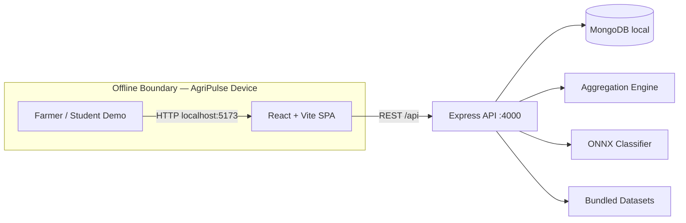
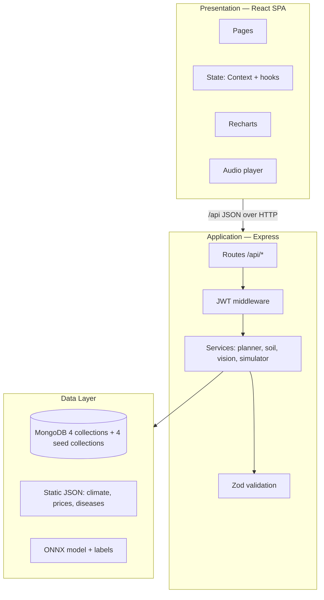
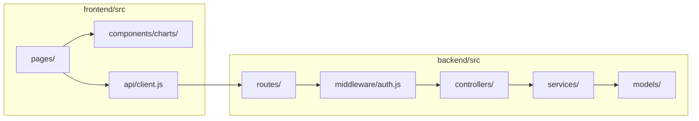
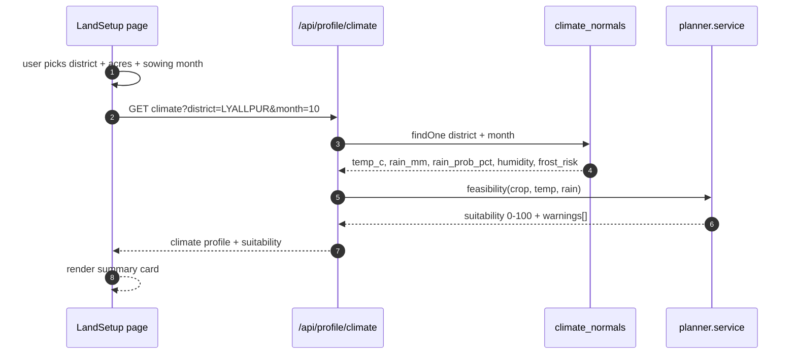
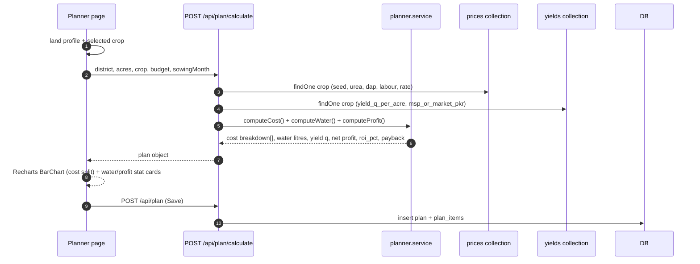
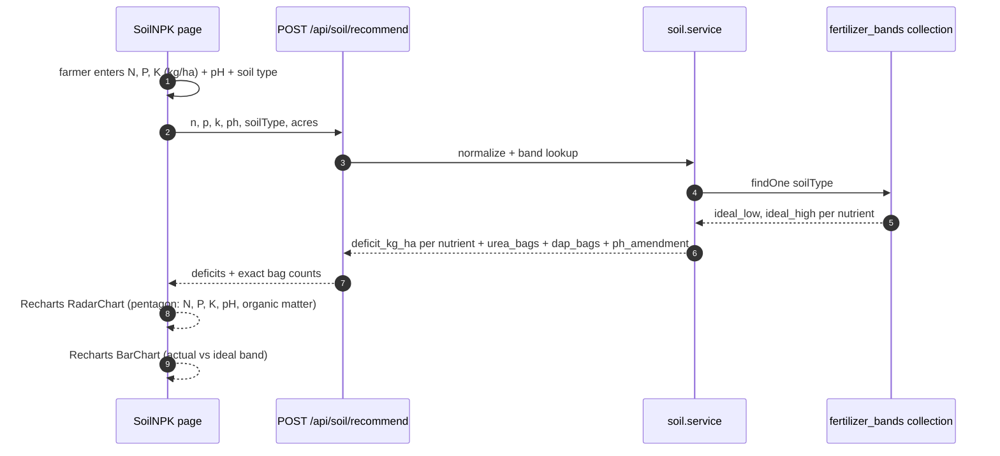
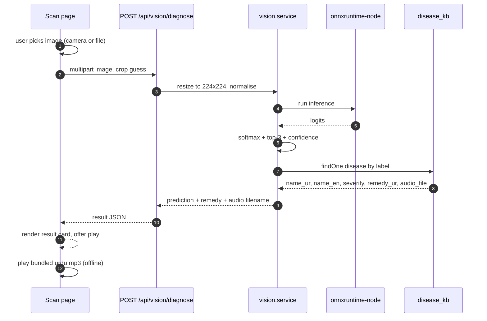
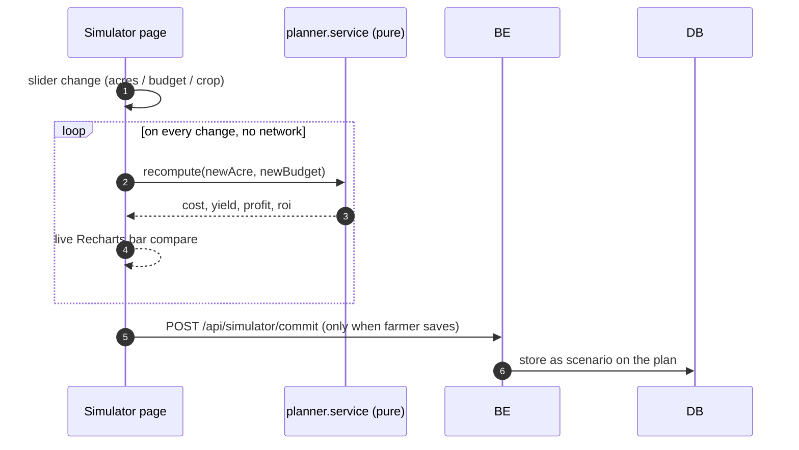
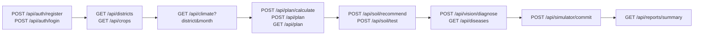

# A1 — AgriPulse AI: Data Flow, Tech Stack, HHD, Exact Data, Wireframes

Specialist roles adopted this turn (fetched read-only from
`specilized-agents-skills-from-agency-agents` via its HTTP API):
`design-ux-architect` (IA + wireframe + CSS/layout foundation),
`design-ui-designer` (visual hierarchy), `engineering-backend-architect`
(API contract + service boundaries), `engineering-database-optimizer`
(collection/index design), `engineering-data-engineer` (data dictionary).

> Note on "HHD": read as **High-level Design** (the HLD deliverable of an FYP
> proposal). If you meant **hardware**, Section 8 answers that — answer is zero
> hardware, and that is the project's selling point.

---

## 1. The one-line architecture

A **fully offline MERN web app**. Every dependency (climate data, disease
model, Urdu audio, crop economics) is bundled or runs in-process. No API key,
no cloud, no internet at runtime. The internet is used **once, by you, before
submission**, to download the data and weights into `app/backend/assets/`.

```
React SPA  ──HTTP/JSON──►  Express API  ──►  MongoDB (local)
   │                            │
   │                            ├──► Aggregation engine (formulas)
   │                            ├──► ONNX disease classifier (local)
   │                            └──► Static reference datasets (JSON seed)
   └── Recharts + local Urdu audio clips (no CDN)
```

---

## 2. Tech stack — locked, with the reason

| Layer | Choice | Why this one (reliable, offline, student-buildable) |
|---|---|---|
| Frontend | React 18 + Vite | Fastest local dev, no SSR complexity |
| Styling | Tailwind CSS + CSS variables | `design-ux-architect` rule: light/dark/system theme tokens as a baseline |
| Charts | **Recharts** (`RadarChart`, `BarChart`) | Built-in `Radar` for the NPK pentagon; no d3 boilerplate |
| Backend | Node.js 20 LTS + Express | Pure MERN, single language, no Python step |
| DB | MongoDB 7 **local** (`mongod`), Mongoose | MERN requirement; local daemon = offline |
| Auth | JWT (access token) + bcrypt | Standard, no external IdP |
| Weather | **Bundled dataset** — pre-seeded monthly climate normals per PK district | Removes OpenWeather dependency. Open-Meteo was scraped once at build time and frozen into JSON |
| Disease AI | **ONNX Runtime for Node** (`onnxruntime-node`) + a PlantVillage-trained model file | Inference in the same Node process. No Python, no serverless, no API key |
| Urdu audio | **Pre-recorded `.mp3` clips** bundled per disease + `ur-PK` Web Speech as optional enhancement | Bundled clips = guaranteed offline. Browser TTS is unreliable offline, so it is never the only path |
| Validation | Zod (schemas shared FE/BE) | One contract, two consumers |
| Reports | `react-to-print` → PDF | No server PDF lib needed |
| Offline guarantee | Service Worker (workbox) caching app shell + assets | Second load works with the network cable pulled |

**Rejected, and why** — these look better in the proposal but fail offline:

| Tempting option | Rejected because |
|---|---|
| OpenWeather live API | Needs network + key at runtime. Breakage during the viva demo kills the demo |
| Roboflow / HuggingFace inference API | Network + token + rate limits + quota. Same demo risk |
| TensorFlow.js in the browser | Works, but you ship 5MB+ of weights to the client and lose a clean backend service. ONNX in Node is better for your report |
| Python FastAPI microservice for ML | Splits the stack away from MERN. Supervisor has to defend a 2-language system |
| MongoDB Atlas | Cloud. Violates "100% local" |

---

## 3. High-level Design (HHD)

### 3.1 System context — the trust boundary



### 3.2 Container view — the MERN split



### 3.3 Component responsibilities



---

## 4. Data flow, part by part

### 4.1 Module 1 — City & Land Profiler



Nothing is fetched from the internet here. `climate_normals` was populated
once by the seed script.

### 4.2 Module 2 — Resource & Financial Calculator



The **only** input that can never be pre-computed is `acres × rate × yield`, so
the formulas live in one service file and are pure functions — that is what
makes them testable and presentable.

### 4.3 Module 3 — NPK Soil Health Radar



### 4.4 Module 4 — AI Vision Scan + Urdu Audio



Audio is a **local file served by Express static**, not TTS at runtime. This is
the single most reliable choice in the whole project.

### 4.5 Module 5 — What-If Profitability Simulator



Pure client-side recompute is deliberate: instant response, no DB round trip,
and the demo never stalls.

---

## 5. ER diagram — the exact data model

```mermaid
erDiagram
  USER ||--o{ LAND : owns
  USER ||--o{ PLAN : creates
  LAND ||--o{ SOIL_TEST : has
  PLAN ||--o{ PLAN_ITEM : itemises
  PLAN ||--o{ SCENARIO : simulates
  PLAN ||--o{ SCAN : triggers
  CROP ||--o{ PLAN : referenced_by
  CROP ||--o{ YIELD_BAND : yields
  CROP ||--o{ PRICE_BAND : costs
  SOIL_TYPE ||--o{ FERTILIZER_BAND : prescribes
  DISEASE ||--o{ SCAN : detected_in

  USER { ObjectId id PK, String name, String email UK, String passwordHash, String role, Date createdAt }
  LAND { ObjectId id PK, ObjectId userId FK, String district, Float acres, String soilType, Date createdAt }
  SOIL_TEST { ObjectId id PK, ObjectId landId FK, Float nKgh, Float pKgh, Float kKgh, Float ph, Float organicMatter, Date testedAt }
  PLAN { ObjectId id PK, ObjectId userId FK, ObjectId landId FK, String cropId FK, Int sowingMonth, Float budgetPkr, Float totalCostPkr, Float waterLitres, Float expectedYieldQ, Float netProfitPkr, Float roiPct, String status }
  PLAN_ITEM { ObjectId id PK, ObjectId planId FK, String category, String label, Float quantity, Float unitRatePkr, Float lineTotalPkr }
  SCENARIO { ObjectId id PK, ObjectId planId FK, String label, Float acres, Float budgetPkr, Float costPkr, Float profitPkr, Float roiPct }
  SCAN { ObjectId id PK, ObjectId userId FK, String imagePath, String cropGuess, String diseaseCode FK, Float confidencePct, String audioFile, Date scannedAt }
  CROP { String code PK, String nameEn, String nameUr, Int seasonCode }
  YIELD_BAND { String cropCode FK, String region, Float qPerAcre, Float pricePkrPerQ }
  PRICE_BAND { String cropCode FK, String itemCode, Float unit, Float ratePkr, Int validFrom }
  SOIL_TYPE { String code PK, String nameEn, String nameUr }
  FERTILIZER_BAND { String soilTypeCode FK, String nutrient, Float idealLow, Float idealHigh, Float ureaBagsPerHa, Float dapBagsPerHa }
  CLIMATE_NORMAL { ObjectId id PK, String district, Int month, Float tempC, Float rainMm, Float rainProbPct, Float humidityPct }
  DISEASE { String code PK, String nameEn, String nameUr, String severity, String remedyEn, String remedyUr, String audioFile, String preventionUr }
```

### 5.1 User-supplied data (the farmer must type/choose this)

| Field | Page | Type | Required |
|---|---|---|---|
| name, email, password | Auth | string | yes |
| district (city) | Land Setup | select from 30 PK districts | yes |
| land area (acres) | Land Setup | number, 0.1–100 | yes |
| soil type (sandy/loam/clay/silt) | Land Setup | select | yes |
| crop | Planner / Simulator | select from crop master | yes |
| sowing month | Planner | select 1–12 | yes |
| input budget (PKR) | Planner | number | yes |
| N, P, K (kg/ha) | Soil NPK | number ×3 | yes |
| pH (0–14) | Soil NPK | slider | yes |
| organic matter % | Soil NPK | slider | no |
| leaf/flower image | Disease Scan | file / camera | yes |
| saved plan name + label | Reports | string | no |

### 5.2 Reference data you must supply (bundled, not typed by farmers)

| Dataset | Rows (approx) | Where it comes from |
|---|---|---|
| `climate_normals` | 30 districts × 12 months = **360** | Open-Meteo archive API scraped once, frozen to JSON, seeded |
| `crop` | 20–25 PK crops (wheat, rice, cotton, sugarcane, maize, berseem, potato, tomato, chilli, mango…) | FAOSTAT / Punjab Agriculture Dept |
| `yield_band` | 25 crops × 3 regions = **75** | FAOSTAT + local extension averages |
| `price_band` | 25 crops × 6 input items × 1 season = **150** | Punjab Agriculture Department rate notifications |
| `soil_type` | 5 | Standard agronomy |
| `fertilizer_band` | 5 soils × 4 nutrients = **20** | Soil Testing Lab recommendations |
| `disease_kb` | **38** PlantVillage classes + 2 PK-specific (cotton leaf curl, wheat rust) | PlantVillage + local extension |
| Urdu audio | **~40 clips**, 8–15 s each, mono 22 kHz mp3 | Record yourself / a colleague. One clip per disease |
| ONNX model | 1 file, ~15–20 MB, 38 classes | Train on PlantVillage, export to ONNX, commit to `app/backend/assets/` |

Total seed volume: **≈ 660 reference rows + 40 audio files + 1 model file.**

---

## 6. API contract



Every route except `register`, `login`, `GET /api/districts`, `GET /api/crops`,
`GET /api/diseases` sits behind `middleware/auth.js` (JWT verify).

---

## 7. Frontend wireframes — 9 pages

Navigation shell is the same on every page: a **top bar** (logo, district
chip, Urdu voice toggle, profile) and a **left sidebar**. Mobile collapses the
sidebar into a bottom tab bar.

### Page map vs the 4 problems

| # | Page | Problem it closes |
|---|---|---|
| 1 | Login / Register | identity, saved history |
| 2 | Dashboard | all — entry point + weather risk alert |
| 3 | Land & Soil Setup | P1 uninformed decisions |
| 4 | Resource & Financial Planner | P2 no pre-harvest planning |
| 5 | NPK Radar & Fertilizer Dosage | P1 uninformed decisions |
| 6 | Profit Simulator (What-If) | P2 decision confidence |
| 7 | Disease Scan + Urdu Audio | P3 unreadable diagnoses |
| 8 | Reports & History | P2 record / proof |
| 9 | Settings / Profile + Reference Data | usability, admin view |

```
┌──────────────────────────────────────────────────────────────────────┐
│ 1. LOGIN / REGISTER                             [theme] [lang toggle]│
├──────────────────────────────────────────────────────────────────────┤
│                                                                      │
│        ┌──────────────────────────────────┐                          │
│        │        AGRI PULSE AI             │  ← logo + 1 line value   │
│        │  "Know your cost before you sow" │    proposition           │
│        └──────────────────────────────────┘                          │
│                                                                      │
│        [ Login ]  [ Register ]        ← tabs                         │
│                                                                      │
│        Email    ______________________                               │
│        Password ______________________   [ show ]                     │
│                                                                      │
│        [      Sign in      ]                                           │
│        [      Create account ]                                       │
│                                                                      │
│        Works fully offline · No data leaves this machine             │
└──────────────────────────────────────────────────────────────────────┘
```

```
┌──────────────────────────────────────────────────────────────────────┐
│ 2. DASHBOARD                          [District: Faisalabad ▾] [EN/اردو]│
├───────────────┬──────────────────────────────────────────────────────┤
│ ◉ Dashboard   │  ┌─────────────┐┌─────────────┐┌─────────────┐       │
│ ○ Land & Soil │  │ 6.2 acres   ││ PKR 184,300 ││ 412,000 L   │       │
│ ○ Planner     │  │ active land ││ est. cost   ││ water needed│       │
│ ○ NPK Radar   │  └─────────────┘└─────────────┘└─────────────┘       │
│ ○ Simulator   │  ┌─────────────────────────────────────────────┐    │
│ ○ Disease Scan│  │ ⚠ OCT WEATHER RISK — 62% rain probability    │    │
│ ○ Reports     │  │   Sowing window for wheat closes in 9 days    │    │
│ ○ Settings    │  └─────────────────────────────────────────────┘    │
│               │  ┌───────────────────────┐┌───────────────────────┐  │
│  🔊 Urdu voice│  │  Cost vs Yield trend  ││  Recent plans         │  │
│     [ ON ]    │  │  (Recharts BarChart)  ││  Wheat  6.2ac  +14%   │  │
│               │  └───────────────────────┘└───────────────────────┘  │
│               │  ┌─────────────────────────────────────────────┐    │
│               │  │  QUICK ACTIONS                              │    │
│               │  │ [ New land ] [ Plan a crop ] [ Scan a leaf ] │    │
│               │  └─────────────────────────────────────────────┘    │
└───────────────┴──────────────────────────────────────────────────────┘
```

```
┌──────────────────────────────────────────────────────────────────────┐
│ 3. LAND & SOIL SETUP                          [ Save ] [ Next ▸]     │
├───────────────┬──────────────────────────────────────────────────────┤
│ sidebar       │  STEP 1 of 2 — Location & Area                       │
│               │  ┌────────────────────────────┐ ┌────────────────┐  │
│               │  │ District   [Faisalabad   ▾] │ │ Area (acres)   │  │
│               │  └────────────────────────────┘ │ │ [  6.2      ] │  │
│               │  ┌────────────────────────────┐ └────────────────┘  │
│               │  │ Soil type  [ Loam       ▾] │                      │
│               │  └────────────────────────────┘                      │
│               │  ┌────────────────────────────────────────────────┐  │
│               │  │ CLIMATE PROFILE — October, Faisalabad         │  │
│               │  │  27°C avg   18 mm rain   62% rain prob.       │  │
│               │  │  Frost risk: low    Irrigation days: 6        │  │
│               │  └────────────────────────────────────────────────┘  │
│               │  STEP 2 of 2 — Soil Test Results                     │
│               │   Nitrogen    [ 42 ] kg/ha   ▓▓▓▓░░░░░  LOW        │
│               │   Phosphorus  [ 18 ] kg/ha   ▓▓▓▓▓▓▓░░░  OK        │
│               │   Potassium   [ 55 ] kg/ha   ▓▓▓▓▓▓▓▓░░  HIGH       │
│               │   pH          [ 7.4 ]          ▓▓▓▓▓▓▓░░░  OK        │
└───────────────┴──────────────────────────────────────────────────────┘
```

```
┌──────────────────────────────────────────────────────────────────────┐
│ 4. RESOURCE & FINANCIAL PLANNER                [ Save plan ] [▸ What-if]│
├───────────────┬──────────────────────────────────────────────────────┤
│ sidebar       │  Crop  [ Wheat ▾]   Sowing month [ October ▾]         │
│               │  Budget [ PKR 250,000 ]      Acres [ 6.2 ]           │
│               │  ┌────────────────────────────────────────────────┐  │
│               │  │ TOTAL ESTIMATED COST          PKR 184,300      │  │
│               │  │  Seed          ███████░░░  18,600   2.4 maund   │  │
│               │  │  Fertiliser    ██████████  61,200   5 Urea+DAP │  │
│               │  │  Labour        ██████░░░░  42,000   38 days    │  │
│               │  │  Irrigation    ██░░░░░░░░░  11,500   412,000 L │  │
│               │  │  Transport     ██░░░░░░░░░   9,000               │  │
│               │  │  Stubs/misc    █░░░░░░░░░░  42,000   incl. misc  │  │
│               │  └────────────────────────────────────────────────┘  │
│               │  ┌──────────────────┐┌──────────────────┐┌──────────┐  │
│               │  │ WATER REQUIRED  ││ EXPECTED YIELD   ││ NET PROFIT│  │
│               │  │ 412,000 L       ││ 42.0 maund      ││ PKR 97,700│  │
│               │  │ ~6 irrigations  ││ @ 2,325/maund   ││ ROI 53%  │  │
│               │  └──────────────────┘└──────────────────┘└──────────┘  │
│               │  ⚠ Cost exceeds budget by PKR 0 — fits.                │
└───────────────┴──────────────────────────────────────────────────────┘
```

```
┌──────────────────────────────────────────────────────────────────────┐
│ 5. NPK SOIL HEALTH RADAR                        [ Save ] [ Print ]     │
├───────────────┬──────────────────────────────────────────────────────┤
│ sidebar       │  ┌───────────────────────────┐┌────────────────────┐  │
│               │  │      Recharts RadarChart  ││  DEFICIENCY        │  │
│               │  │         N  ╱╲  pH         ││  Nitrogen  LOW     │  │
│               │  │       P ╱    ╲ K          ││    −18 kg/ha       │  │
│               │  │        │  OM │            ││  Phosphorus OK     │  │
│               │  │         ╲  ╱             ││  Potassium HIGH    │  │
│               │  │      (pentagon)           ││    − reduce dose   │  │
│               │  └───────────────────────────┘└────────────────────┘  │
│               │  ┌────────────────────────────────────────────────┐  │
│               │  │ EXACT FERTILISER DOSAGE — 6.2 acres            │  │
│               │  │  Urea (46% N)   ███████  4 bags  (46 kg/acre)   │  │
│               │  │  DAP  (18-46)   ████     2 bags  (36 kg/acre)   │  │
│               │  │  pH correction █         0 bags  (pH 7.4 = OK)  │  │
│               │  │  Cost impact    PKR 61,200                        │  │
│               │  └────────────────────────────────────────────────┘  │
│               │  🗣 [ ▶ Urdu explanation ]  ← bundled mp3             │
└───────────────┴──────────────────────────────────────────────────────┘
```

```
┌──────────────────────────────────────────────────────────────────────┐
│ 6. WHAT-IF PROFITABILITY SIMULATOR                                  │
├───────────────┬──────────────────────────────────────────────────────┤
│ sidebar       │  BASELINE (6.2 acres, PKR 250k)  vs  SCENARIO        │
│               │  ┌────────────────────────────────┐                 │
│               │  │ Land area      ●━━━━━━━ 6.2 ac  │  ← slider      │
│               │  │ Budget         ━━●━━━━━ 250,000 │  ← slider      │
│               │  │ Crop           [ Wheat      ▾] │  ← select      │
│               │  └────────────────────────────────┘                 │
│               │  ┌────────────────────────────────────────────┐    │
│               │  │  Recharts grouped BarChart                    │    │
│               │  │  ▐ Cost  ▌ Yield  ▐ Profit  (baseline vs now)│    │
│               │  └────────────────────────────────────────────┘    │
│               │  ┌──────────────┐┌──────────────┐┌──────────────┐    │
│               │  │ COST 184,300 ││ PROFIT 97,700││ ROI    53%   │    │
│               │  │ Δ  +0        ││ Δ +12,400    ││ Δ +4 pts     │    │
│               │  └──────────────┘└──────────────┘└──────────────┘    │
│               │  [ Commit scenario ]  [ Reset to baseline ]           │
└───────────────┴──────────────────────────────────────────────────────┘
```

```
┌──────────────────────────────────────────────────────────────────────┐
│ 7. AI VISION SCAN + URDU AUDIO                                       │
├───────────────┬──────────────────────────────────────────────────────┤
│ sidebar       │  ┌────────────────────────────────────────────────┐  │
│               │  │  ┌──────────────┐                             │  │
│               │  │  │   LEAF IMAGE  │   [ 📷 Camera ] [ 🖼 Upload ] │  │
│               │  │  │   preview     │                             │  │
│               │  │  └──────────────┘                             │  │
│               │  └────────────────────────────────────────────────┘  │
│               │  Crop guess [ Wheat ▾]      [  Run diagnosis  ]      │
│               │  ── after diagnosis ─────────────────────────────────  │
│               │  ┌────────────────────────────────────────────────┐  │
│               │  │  Wheat Leaf Rust              CONFIDENCE 94.2% │  │
│               │  │  گندم کی پتی پھوسی      ████████████░░         │  │
│               │  │  Severity: MODERATE                           │  │
│               │  │  ── Remedy (Urdu) ─────────────────────────    │  │
│               │  │  برائی فی کاپ کی جڑ کا رس، ہر 5 دن بعد         │  │
│               │  │  ─────────────────────────────────────────    │  │
│               │  │  🗣 [ ▶ سنیں — Play Urdu ]   (bundled mp3)    │  │
│               │  │  [ 🔁 New scan ]  [ 📄 PDF ]                  │  │
│               │  └────────────────────────────────────────────────┘  │
│               │  Top-3: Leaf Rust 94.2% · Tan Spot 3.1% · Healthy 2.7%│
└───────────────┴──────────────────────────────────────────────────────┘
```

```
┌──────────────────────────────────────────────────────────────────────┐
│ 8. REPORTS & HISTORY                                    [ Export PDF ]│
├───────────────┬──────────────────────────────────────────────────────┤
│ sidebar       │  Filter: [All ▾]  Season: [2026 Rabi ▾]  [ Search ]   │
│               │  ┌────────────────────────────────────────────────┐  │
│               │  │ Wheat · 6.2 ac · Faisalabad      PKR 97,700 ▸  │  │
│               │  │ Oct 2026 · ROI 53% · 412,000 L                │  │
│               │  ├────────────────────────────────────────────────┤  │
│               │  │ Cotton · 4.0 ac · Vehari           PKR 41,200 ▸ │  │
│               │  │ Apr 2026 · ROI 22% · 305,000 L                │  │
│               │  ├────────────────────────────────────────────────┤  │
│               │  │ Rice · 6.2 ac · Faisalabad      PKR 71,800  ▸  │  │
│               │  └────────────────────────────────────────────────┘  │
│               │  ┌──────────────────────────┐┌────────────────────┐  │
│               │  │ SEASON SUMMARY            ││  SCAN HISTORY     │  │
│               │  │ 3 plans · avg ROI 34%     ││  8 scans          │  │
│               │  │ total planned PKR 1.21M   ││  2 flagged        │  │
│               │  └──────────────────────────┘└────────────────────┘  │
└───────────────┴──────────────────────────────────────────────────────┘
```

```
┌──────────────────────────────────────────────────────────────────────┐
│ 9. SETTINGS / PROFILE + REFERENCE DATA                    [ Save ]    │
├───────────────┬──────────────────────────────────────────────────────┤
│ sidebar       │  PROFILE                                             │
│               │   Name  [ Abdullah              ]                    │
│               │   Email [ abd@student.edu       ]  (read-only)       │
│               │   District [ Faisalabad ▾]   Acres [ 6.2 ]            │
│               │  ────────────────────────────────────────────────    │
│               │  ACCESSIBILITY                                       │
│               │   Theme        [ Light | Dark | System ]              │
│               │   Voice output [ on / off ]  ← Urdu narration toggle   │
│               │   Text size    [ 100% ──●── 130% ]                   │
│               │  ────────────────────────────────────────────────    │
│               │  REFERENCE DATA (read-only, seeded)                  │
│               │   Crops 25 · Districts 30 · Climate rows 360         │
│               │   Diseases 40 · Soil types 5 · Fertilizer bands 20   │
│               │   Model: wheat-leaf-onnx-v1.onnx  (38 classes)        │
│               │  ────────────────────────────────────────────────    │
│               │  OFFLINE CHECK  ● App shell cached · ● assets cached  │
│               │  [ Verify offline mode ]   [ Clear local cache ]      │
└───────────────┴──────────────────────────────────────────────────────┘
```

---

## 8. Hardware (if "HHD" meant hardware)

| Item | Qty | Why |
|---|---|---|
| Laptop / desktop | 1 | Chrome/Edge + Node 20 + MongoDB local. 8 GB RAM, 4 GB free disk |
| Smartphone | 1 (optional) | Camera for disease scan; responsive layout |
| Sensors, gateways, meters | **0** | This is the deliberate design choice. The app infers from inputs, not from devices |

Total hardware bill: **one laptop the student already owns.** That is exactly
how you close Problem 4 in the defense — the expensive competitor products
cannot do this.

---

## 9. Recommendations — the honest list

**Do these:**

1. **Train the model yourself on PlantVillage.** Downloading someone else's
   checkpoint is fragile and examiners ask "why this accuracy?". Training on
   Colab, exporting ONNX, committing the file gives you a real methodology
   chapter for free. Target ≥ 95% on the held-out set.
2. **Record the Urdu audio yourself.** 40 clips, 8–15 seconds. Higher quality
   than any offline TTS for Pakistani Urdu, and it is 2 evenings of work. It
   also makes P3 (unreadable diagnoses) genuinely solved rather than claimed.
3. **Seed real district data.** Pull climate normals for the 10–15 districts
   around your own campus. Reviewers will recognise real places.
4. **Pure-function the three engines.** `planner.service`, `soil.service`,
   `simulator` as pure functions with unit tests. This is your testability
   evidence — it separates an FYP from a CRUD project.
5. **Ship the offline check as a feature.** Page 9 has an "Verify offline
   mode" button. Demo it with the router off. That single moment wins the
   viva.
6. **Two Pakistan-specific diseases** (cotton leaf curl virus, wheat rust)
   added to the 38 PlantVillage classes. This is what makes it a *Pakistani*
   FYP rather than a tutorial project.

**Avoid these:**

1. **Do not use a live weather API.** One flaky request during the viva and the
   "no hardware, no internet" claim collapses. Bundled data is the safe call.
2. **Do not add a mobile app.** MERN + PWA already covers mobile. Two codebases
   is scope death for a solo BSCS student.
3. **Do not add farmer-to-farmer marketplace, chat, or ML price prediction.**
   Those are a different FYP. Your four problems are already four modules.
4. **Do not promise "AI disease cure".** Detect and advise; route to the local
   agriculture officer. Overclaiming is the fastest way to lose credibility.
5. **Do not seed prices by guessing.** One table from the Punjab Agriculture
   Department rate notification. Accuracy of the reference data is what the
   whole calculator rests on.

**Effort split that actually finishes:**

| Phase | Weeks | Output |
|---|---|---|
| Data curation + seeding | 2 | 660 reference rows, all in MongoDB |
| Auth + Land + Planner | 3 | pages 1–4 working |
| Soil + Simulator | 2 | pages 5–6 working |
| Model training + ONNX + vision | 3 | page 7 working, ≥95% accuracy |
| Urdu audio recording | 2 | 40 clips (parallel with the above) |
| Reports, settings, offline | 2 | pages 8–9 working |
| Testing, docs, defence prep | 2 | 3 test suites, proposal, slides |

**≈ 16 weeks.** Realistic for one person at a defensible quality level.

---

## 10. How each of the 4 problems is closed — traceability

| Problem | Module | Page | Evidence in the demo |
|---|---|---|---|
| P1 uninformed decisions | NPK radar + exact bag count | 3, 5 | Enter 42/18/55 kg/ha → "Nitrogen LOW by 18 kg/ha → 4 Urea bags" |
| P2 no pre-harvest planning | Planner + Simulator | 4, 6 | Cost/water/profit/ROI before sowing; slider shows ROI 34% → 53% |
| P3 unreadable diagnoses | Vision + Urdu audio | 7 | Photo → 94.2% wheat leaf rust → remedy read aloud in Urdu |
| P4 hardware dependency | Whole system | all | Zero devices; unplug the network and every page still works |

---

*Sources: specialist role definitions fetched read-only from the
`specilized-agents-skills-from-agency-agents` HTTP API; no files were written to
that repository. Climate seed strategy derived from Open-Meteo's archive API
contract; disease classes from PlantVillage.*