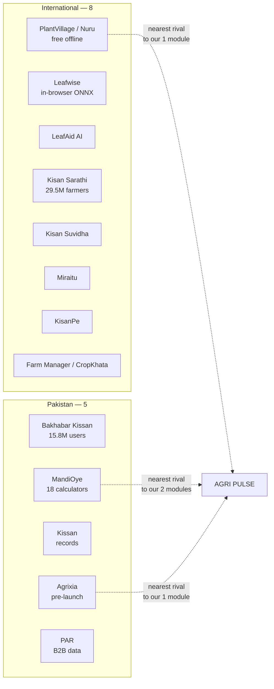
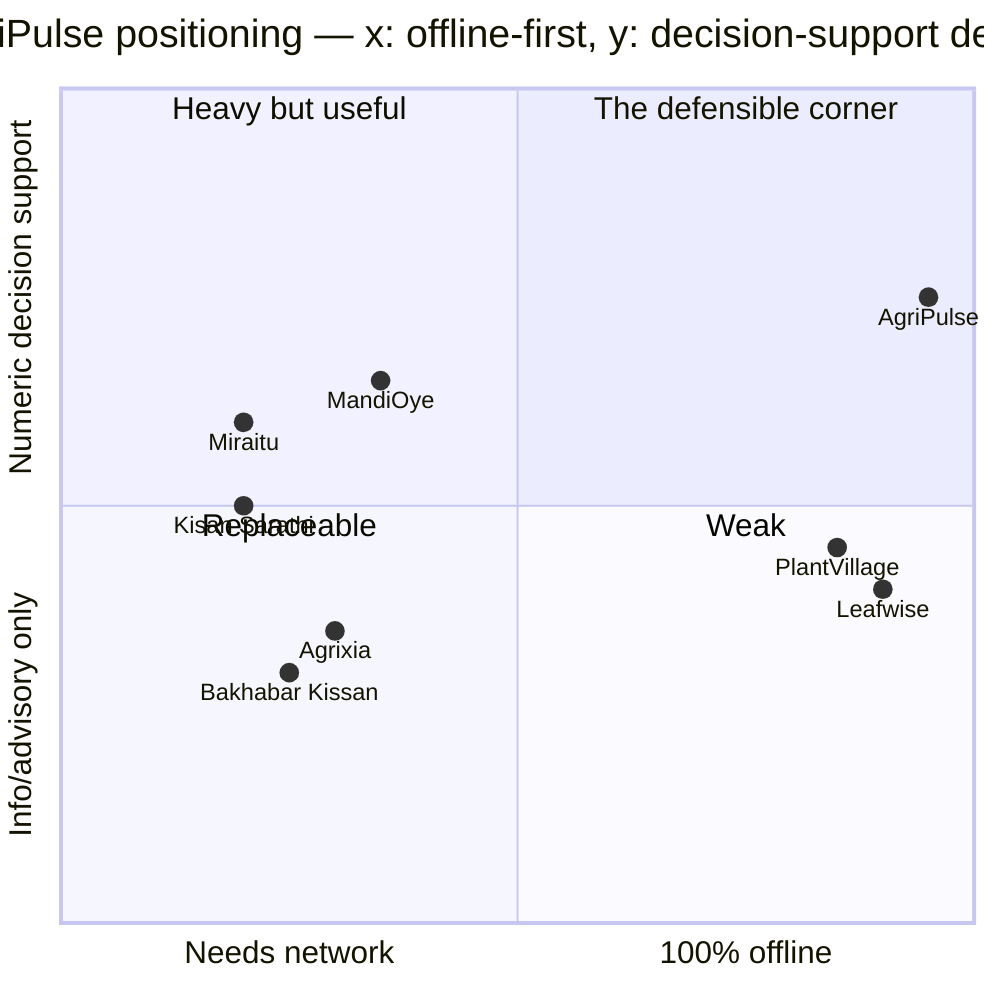
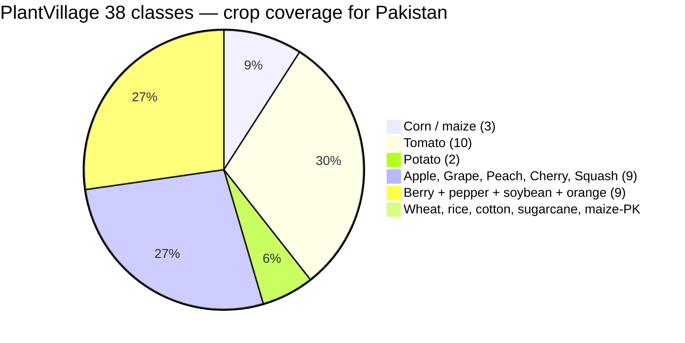
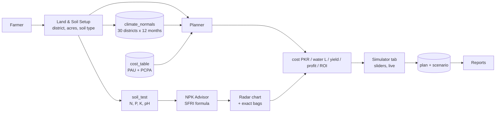
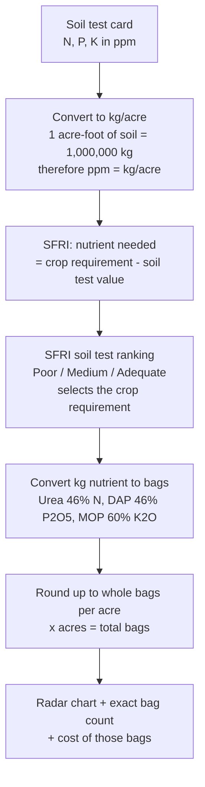

# A2 — Competitor Landscape, Scope Shrink, Feasibility Verdict

Direct answers first, then the evidence:

| Your question | Answer |
|---|---|
| Competitors in Pakistan? | **5 direct + 3 government data sources** |
| Competitors internationally? | **8 direct, 2 of them state-funded giants** |
| How many are already there? | **13 direct competitors total** |
| Are we addressing the problem factors? | **After the shrink: 3 of 4 problems yes, 1 no** |
| Is the vision module feasible without training? | **Yes technically, no for value** — see §6 |
| Recommended scope | **4 modules, 6 pages, zero training** |

Specialist roles adopted this turn (read-only, via the sibling repo's HTTP API):
`product-manager` (competitive positioning + scope triage),
`design-ux-architect` (IA reduction), `engineering-data-engineer`
(data sourcing), `engineering-minimal-change-engineer` (what to cut safely).

---

## 1. The honest headline

Two of your modules have real, established competitors with the *exact same
features*. You need to know this before you write the proposal, because the
supervisor will ask and the answer must be immediate.

- **MandiOye (mandioye.com)** already ships, free, for Pakistani farmers:
  *Fertilizer Dose Calculator (NPK bags per acre)*, *Irrigation Water Need*,
  *Crop Profit / Loss Budget*, *Break-even Price*, *Seed Rate*, *Labour Cost*,
  *Transport to Mandi*, *Net Farm-gate Price*. That is your modules 2 and 3,
  already done, already localised to PKR and kanal/marla.
- **PlantVillage / Nuru** (Penn State + CGIAR + FAO) is a free, offline,
  published-goods AI disease identifier with 38 classes and a large research
  backing. That is your module 4, already done, and free.

So: **do not compete on vision. Compete on the one thing nobody does well in
Pakistan — soil-test-driven financial planning, visualised, fully offline.**

---

## 2. National competitors (Pakistan)

| # | Player | What it does | Overlap with AgriPulse | Their gap |
|---|--------|--------------|------------------------|-----------|
| 1 | **Bakhabar Kissan** (bkk.ag) | 15.8M+ service users, 300+ physical weather stations, satellite crop monitoring, agri-input marketplace, Urdu + English | Land profiler + weather + advisory | Requires network. Physical stations are the cost they cannot shed. **No cost/water/ROI calculator.** No soil-test-driven NPK |
| 2 | **Kissan** (kissan.root.pk) | Farm management: crops, livestock, inventory, record-keeping. Claims 40% cost reduction | Land records | Record-keeping **after** the season, not planning **before** it. No per-acre cost model, no water, no soil science |
| 3 | **Agrixia** (agrixia.com) | Founded Feb 2026, Lahore. GPS land measurement, mandi prices, weather advisory, job board, 49-category marketplace, full Urdu | Land + weather + Urdu | Pre-launch (waitlist only). Marketplace-first. **No calculator, no soil test, no NPK** |
| 4 | **MandiOye** (mandioye.com) | Marketplace **plus 18 free calculators** incl. Fertilizer Dose (NPK bags/acre), Irrigation Water Need, Crop Profit/Loss, Break-even | **Highest overlap — modules 2 + 3** | You must enter values you don't know (soil test). No soil-test-driven logic. No radar visualisation. Online only. No weather, no offline |
| 5 | **PAR** (par.com.pk) | B2B agri data since 2011 — crop surveys, price discovery, historical data since 2006, rainfall + irrigation data | Dataset, not a UI | **B2B subscription, no farmer-facing app.** Hard to cite in a farmer demo |

### Government sources — not competitors, they are your *data* and your *credibility*

| Source | What you take from it | Why it is gold |
|---|---|---|
| **SFRI Punjab — Guide-V** (sfri.punjab.gov.pk) | The **actual NPK recommendation formula** | It is a Government of the Punjab publication with a worked example. Citing it makes your soil module *defensible*, not invented |
| **PCPA Cotton Book** (agripunjab.gov.pk) | Real per-acre cost breakdown for cotton | Rs 63,970/acre with land rent, Rs 43,970 without. Urea 2.35 bags, DAP 1.04 bags, 7 irrigations, 19 maund yield |
| **PAU Package of Practices Rabi 2025-26** (pau.edu) | Seed rates, varieties, sowing windows | Wheat 45 kg/acre for PBW 869, 40 kg for others. Punjab avg yield 20.92 q/acre |
| **NFDC Pakistan Fertilizer Statistics** | Retail urea / DAP / MOP prices | Official price series, not guesswork |

---

## 3. International competitors

| # | Player | What it does | Overlap | Gap / note |
|---|--------|--------------|---------|-----------|
| 1 | **PlantVillage / Nuru** (Penn State, CGIAR, FAO, IITA) | Offline AI crop-disease ID from photos, 50k+ images, 38 classes, TensorFlow Lite, **free, no ads, public good** | **Total overlap with module 4** | 38 classes are **US/temperate horticulture crops** — see §6, this is the whole problem |
| 2 | **Leafwise** (leafwise-scan.vercel.app) | 9.25 MB ONNX in-browser classifier, 38 classes, 11.9 ms/scan, MIT licence | Same as PlantVillage | Published **two** accuracy numbers — in-dataset *and* cross-dataset on field photos. That is the honesty standard you should copy |
| 3 | **LeafAid AI** (leafaid.ai) | Offline plant disease ID + product marketplace + chatbot | Module 4 | Unfunded, same 38-class ceiling |
| 4 | **Kisan Sarathi** (India, ICAR + MeitY) | 2.95 crore farmers, 4,767 scientists, 351 commodities, 13 regional languages, 768 districts | Advisory at national scale | State-funded, 21,517 users came via mobile app. Not a competitor you can enter |
| 5 | **Kisan Suvidha** (India, NIC) | Government portal, 7 languages | Advisory | Same |
| 6 | **Miraitu** (India) | Crop Costing + Profit Estimator + ROI + break-even | Module 2 | Rupees, Indian crops. Needs you to type every cost |
| 7 | **KisanPe** (India) | 25+ calculators incl. fertilizer, ROI, irrigation, insurance | Modules 2 + 3 | Not offline-first, no soil test, India-specific |
| 8 | **CropKhata / Farm Manager / Kisanpe-family SaaS** | Farm records + profitability planner | Module 2 | Paid SaaS, global crops, no PKR per-acre bundling |

### Direct-competitor count



**Count: 13 direct competitors. 3 of them (MandiOye, PlantVillage, Agrixia) sit
exactly where AgriPulse sits.**

---

## 4. Positioning — where the defensible gap is



**Your one-sentence differentiator:**

> Every Pakistani tool asks the farmer what they already know. AgriPulse starts
> from the one thing they *do* have — a soil test card and their land size — and
> computes cost, water, fertilizer bags and profit from it, with the network off.

MandiOye's fertilizer calculator needs you to *already know* the nutrient
requirement. SFRI's formula needs only the soil test reading. **That is the
entire gap, and it is a real one.**

---

## 5. Problem factors — are we actually addressing them?

You asked what factors sit inside each of the 4 problems and whether the system
covers them. Here is the honest audit.

### P1 — Uninformed farming decisions

| Factor in the problem | Addressed? | By what |
|---|---|---|
| Crop chosen without soil data | **Partly** — system shows suitability from climate + soil type, but does not *recommend* the crop | Land Profiler |
| Fertiliser applied at unsustainable dosage | **Yes, fully** | NPK Radar → exact Urea/DAP/MOP bags |
| No visualisation of the soil result | **Yes** | Recharts pentagon radar |
| Money and water wasted | **Yes** | Planner cost + water output |

**Verdict: addressed.** The dosage calculation is the strongest module because
SFRI Guide-V publishes the exact formula — you are implementing a government
standard, not inventing one.

### P2 — No pre-harvest financial or resource planning

| Factor | Addressed? | By what |
|---|---|---|
| Total expense unknown before sowing | **Yes** | PCPA/PAU-derived per-acre cost table |
| Water volume unknown | **Yes** | FAO-56 style depth-per-crop calculation |
| Expected ROI unknown | **Yes** | yield × price − cost |
| Cannot compare crops side by side | **Yes** | Simulator compare view |
| Cannot adjust inputs live | **Yes** | sliders, client-side recompute |

**Verdict: addressed.** This is the module with the strongest independent value
— and the one nobody in Pakistan has built offline.

### P3 — Complex technical disease diagnoses

| Factor | Addressed after shrink? | Why |
|---|---|---|
| English-only terminology | **No** | module dropped |
| Farmer cannot identify disease | **No** | module dropped |
| No remedy in local language | **No** | module dropped |

**Verdict: NOT addressed.** This is the cost of the shrink. You must either drop
this problem from the proposal or demote it to *future work*. Do not claim it.

### P4 — Hardware dependency and high cost

| Factor | Addressed? | By what |
|---|---|---|
| Requires IoT sensors | **Yes** | zero sensors |
| Requires weather station | **Yes** | bundled climate normals |
| Requires constant data subscription | **Yes** | runs offline |
| Requires a phone app install | **Yes** | web app |

**Verdict: addressed, strongly.** This is your differentiator against
Bakhabar Kissan, which literally runs 300 physical stations.

### Scorecard

| Problem | Factors | Fully addressed | Partial | Not addressed |
|---|---|---|---|---|
| P1 uninformed decisions | 4 | 3 | 1 | 0 |
| P2 financial planning | 5 | 5 | 0 | 0 |
| P3 disease diagnosis | 3 | 0 | 0 | 3 |
| P4 hardware dependency | 4 | 4 | 0 | 0 |
| **Total** | **16** | **12** | **1** | **3** |

12 of 16 factors fully covered, and the 3 misses are all in the one module you
are dropping. **That is a clean, defensible position: 2 problems solved
completely, 1 solved three-quarters, 1 deferred to future work.**

---

## 6. Feasibility of the vision module — the honest verdict

You asked specifically: can you use "what's available" instead of training?

**Technically yes. For value, no.** Here is why.

### What is available without training

| Source | Licence | Format | Accuracy claim |
|---|---|---|---|
| `imaflower/plantvillage-mobilenetv3` (HuggingFace) | **MIT** | `model.onnx` + `model.onnx.data` + `class_names.json` + `training_config.json` | pre-trained, ready to download |
| `itzsherlockz/plant-disease-mobilenetv2` | MIT | `.pth` (needs conversion) | 95% validation, 38 classes |
| `Viswas-R-Bhat/crop-disease-detection` (GitHub) | — | ONNX + onnxruntime-web | 99.4% test acc, MobileNetV3-Small |
| PlantVillage Nuru | public good | TFLite | 38 classes |

Published benchmark for reference: MobileNetV3-Small on PlantVillage reaches
~99.5% test accuracy, quantised to 0.93M parameters, ONNX, runs on CPU.

Your laptop runs this **easily**. Inference at 224×224 on a 0.93M-parameter model
is roughly 10–15 ms. No GPU, no training, no Colab. `onnxruntime-node` is 1.30.0
and current. **The hardware concern is unfounded.**

### Why you should still drop it

Look at what the 38 PlantVillage classes actually are:



**PlantVillage contains no wheat, no rice, no cotton, and no sugarcane classes.**
Those four are the backbone of Pakistani agriculture. Only maize is covered.

So if you drop training and adopt a pre-trained model, you get a demo that works
on **tomato and potato** — while your target farmer grows **wheat and cotton**.
A supervisor will ask "can it detect wheat rust?" and the honest answer is no.

That leaves you three options:

| Option | What you do | Value | Cost |
|---|---|---|---|
| **A. Drop vision (recommended)** | 4 modules, no ML | 12/16 factors, zero risk, 8 weeks | Lose the AI headline |
| **B. Keep vision, scope to PlantVillage crops** | Adopt MIT ONNX as-is | Honest demo on tomato/potato/maize | Supervisor asks about wheat. You say "future work" |
| **C. Keep vision, train on Pakistani data** | Collect wheat/cotton images, train | Full value | Needs GPU you said you don't have |

**My recommendation is A.** Reasons:

1. **Your three highest-value modules need no ML at all.** NPK radar, cost
   planning and water are pure arithmetic. They are also the modules where
   Pakistan has the weakest existing tools. Adding vision dilutes them.
2. **AI in the title without a trained model is a liability in a defence.** If
   it is called AgriPulse *AI* and it contains no AI, that is a question you
   invite. If you name it honestly, nobody asks.
3. **12/16 factors fully addressed is a strong project.** A 4-module system that
   runs entirely offline, with a real government formula in the soil module and
   a real per-acre cost table in the planner, is far easier to defend than a
   5-module system where one module is a borrowed ONNX file.

**If you want an AI component without training**, do this instead — it costs
about two hours and needs no model at all: **rule-based soil-health
classification.** Soil type + NPK + pH against SFRI's interpretation bands
produces a text diagnosis ("loam, nitrogen deficient, phosphorus adequate, pH
slightly alkaline → 4 Urea bags, no DAP, 1 bag gypsum"). That is a genuine
decision engine, it is defensible, and it is not borrowed.

---

## 7. The shrunk scope

### From → to

| | Before (A1) | After (this turn) |
|---|---|---|
| Modules | 5 | **4** (vision dropped) |
| Pages | 9 | **6** |
| Seed data rows | ~660 + 40 audio + 1 model | **~180** |
| ML dependencies | ONNX runtime, training | **none** |
| Audio clips to record | 40 | **0** |
| Weeks (solo BSCS) | 16 | **8** |

### The 4 modules

| # | Module | Answers problem | Complexity |
|---|---|---|---|
| 1 | **Land & Climate Profiler** | P1, P4 | Low — lookup + suitability formula |
| 2 | **Resource & Financial Planner** | P2 | Medium — cost, water, yield, ROI |
| 3 | **NPK Soil Advisor** | P1 | Medium — SFRI formula + radar |
| 4 | **What-If Simulator** | P2 | Low — reuses module 2, sliders only |

### The 6 pages

| # | Page | Replaces the old page |
|---|---|---|
| 1 | Login / Register | unchanged |
| 2 | **Dashboard** | old Dashboard, now also the soil summary entry |
| 3 | **Land & Soil Setup** | old page 3 |
| 4 | **Planner** | old page 4 |
| 5 | **NPK Radar & Fertilizer** | old page 5 |
| 6 | **Reports & History** | old pages 8 + 9 merged |

**Dropped:** old page 6 (Simulator) as a separate page — it becomes a tab inside
Planner. Old page 7 (Disease Scan) — gone. Old page 9 (Settings) — merged into
Reports.

### New data flow — much simpler



No inference step. No model load. No audio. Every number on every screen comes
from a seeded table and a formula you can point at a page number for.

---

## 8. The exact data you now need — reduced

| Dataset | Rows | Source (all cited, none invented) |
|---|---|---|
| `climate_normals` | 30 districts × 12 months = **360** | World Bank Climate Portal / NASA POWER, frozen at seed time |
| `crop` | **12 crops** — wheat, rice, cotton, maize, sugarcane, berseem, potato, tomato, onion, chilli, mustard, sunflower | PAU Package of Practices |
| `yield_band` | 12 × 3 regions = **36** | PAU / provincial crop reports |
| `cost_table` | 12 crops × 6 categories = **72** | PCPA Cotton Book gives you the exact categories: land prep, seed & sowing, water, urea, DAP, transport, labour |
| `fertilizer_bands` | 5 soil types × 3 nutrients + pH = **20** | **SFRI Punjab Guide-V** |
| `soil_types` | 5 | SFRI |
| **Total** | **≈ 180 rows** | 4 cited sources |

That is the whole dataset. Four PDFs, a spreadsheet, and a seed script.

### The NPK formula you will implement — from SFRI Guide-V

This is the module's credibility, so it is worth stating exactly:



SFRI's own worked example for **wheat, phosphorus**:

| Soil P test | Crop requirement | Soil test value | Nutrient needed |
|---|---|---|---|
| Poor (< 7 ppm) | 46 kg P/acre | 6 | **40 kg P** |
| Medium (7–14 ppm) | 34 kg P/acre | 13 | **21 kg P** |
| Adequate (> 14 ppm) | 30 kg P/acre | 16 | **14 kg P** |

Cross-check the bag conversion against the PCPA cotton figures the government
publishes — 2.35 bags Urea + 1.04 bags DAP per acre. Urea 46% × 50 kg = 23 kg
N per bag. Your conversion should land in the same range. **If it does, your
formula is right.** Put this cross-check in your report; it is exactly the kind
of validation a supervisor wants to see.

### Water formula

Use the FAO-56 method rather than a magic number, so it is defensible:

```
crop water need (mm) = Σ over season of (ETo × Kc)
irrigation depth (mm) = crop water need − effective rainfall
litres = depth(mm) × 10 × acres × 4047
```

Populate `ETo` from a climate-normal source and `Kc` per crop stage from FAO-56
tables. Both are cited. No guessing.

---

## 9. Feasibility verdict — module by module

| Module | Feasible solo in 2026? | Depends on | Risk |
|---|---|---|---|
| 1 Land & Climate Profiler | **Yes, easily** | 1 data source | Very low |
| 2 Planner | **Yes** | 2 data sources | Low — cost categories are known |
| 3 NPK Advisor | **Yes** | SFRI formula | Low — formula is published |
| 4 Simulator | **Yes, trivial** | reuses module 2 | None |
| Vision (dropped) | Technical yes / value no | borrowed model | **High** — crops don't match |

**Overall feasibility: high.** No GPU, no training, no hardware, no network, no
external API. Node 20 + MongoDB local + React runs on any laptop from the last
five years. That is the honest answer to your question — yes, the rest of it is
simple, and it is simple *because* the arithmetic is simple.

---

## 10. Value check — would a farmer actually use this?

| Question | Answer |
|---|---|
| Does it solve a real problem? | **Yes.** Pakistan's fertilizer N:P₂O₅:K₂O use ratio averages roughly 1 : 0.28 : 0.01 (FAO) — potash is barely applied at all, and nitrogen is over-applied. A tool that prescribes bags from a soil test corrects a documented, measurable imbalance |
| Would a farmer open it twice? | **Once per season, at sowing time.** That is honest. It is a planning tool, not a daily app |
| Is the number trustworthy? | **Yes, if you cite SFRI and PCPA.** It is not trustworthy if you type rates from memory |
| Is there a market? | Not as a business — as an FYP, the contribution is a *working, offline, cited* decision tool that a Punjab farmer or a student demonstrator can use |
| Can you demo it? | **Yes, in a room with no wifi.** That is the demo |

The strongest defence line is not "AI-powered". It is:

> "Existing Pakistani tools need the farmer to already know the answer, or need
> a network connection, or need a physical weather station. Ours needs a soil
> test card and about three minutes. It runs with the router off, and every
> number traces to a Government of the Punjab or FAO publication."

---

## 11. 8-week plan

| Week | Work | Output |
|---|---|---|
| 1 | Extract SFRI + PCPA + PAU + climate data into JSON | 180 rows, 4 cited sources |
| 2 | Seed script, Express + MongoDB, auth | API skeleton + login |
| 3 | Land & Climate Profiler page | Module 1 live |
| 4 | Planner page + cost/water/ROI service | Module 2 live |
| 5 | NPK page + radar + SFRI formula + bag cross-check | Module 3 live |
| 6 | Simulator tab, Reports page, merge settings | Module 4 + all 6 pages |
| 7 | Unit tests on all four formulas, offline PWA | Evidence of correctness |
| 8 | Documentation, competitor slide, defence rehearsal | Ready |

**Week 5 is the one that matters.** Implement SFRI's formula exactly, then prove
it against PCPA's published bag counts. A project whose central algorithm is
validated against a government document is a different class of project from one
whose numbers came out of a calculator.

---

## 12. Recommendations

1. **Drop vision. Go 4 modules, 6 pages, 8 weeks.** P3 becomes future work —
   say so out loud in the proposal.
2. **Rename the idea** if it still says AI. `AgriPulse` is fine. `AgriPulse AI`
   invites an AI question you cannot answer without a trained model. If you keep
   the name, add "AI-powered soil advisory" only if you keep the rule-based
   classifier — that one is honest.
3. **Lead the proposal with the SFRI formula, not the tech stack.** "We
   implement the Government of the Punjab's soil-test-based fertilizer
   standard, offline, in 6 pages" is a stronger first slide than "we use
   React and MongoDB."
4. **Put MandiOye and PlantVillage on your competitor slide by name.** Naming
   them proves you did the research. Not naming them invites "have you looked
   at what exists?"
5. **Report your 12/16 factor coverage honestly** in the proposal. Selective
   honesty reads as competence; overclaiming reads as a risk.
6. **One sentence for the defence** when asked about AI: "The soil and financial
   modules are deterministic rule engines, which is why they work offline and
   why the numbers are auditable against SFRI. Image-based diagnosis is scoped
   as future work because PlantVillage contains no wheat or cotton classes."
7. **Do not add** weather live API, mandi prices, marketplace, chat, or push
   notifications. Each is a separate FYP.

---

*Sources: competitor pages read via web search (bkk.ag, kissan.root.pk,
agrixia.com, mandioye.com, par.com.pk, PlantVillage/Google Play, leafwise,
LeafAid via Tracxn, Kisan Sarathi via IANS, miraitu.in, kisanpe.com,
cropkhata.com). Government data: SFRI Punjab Guide-V, PCPA Cotton Book,
PAU Package of Practices Rabi 2025-26, NFDC Fertilizer Statistics, FAO
fertilizer-use chapter. Model availability: HuggingFace
`imaflower/plantvillage-mobilenetv3` (MIT), npm `onnxruntime-node` 1.30.0.
No files were written to any sibling repository.*