# A3 — Scope Refined to the Gap, Full Boundary, HHD, LLD, Data Allocation

Specialist roles adopted this turn (read-only, sibling repo HTTP API):
`engineering-software-architect` (HHD/LLD, system decomposition),
`design-ux-architect` (IA boundary), `engineering-backend-architect`
(service boundaries, API contract), `engineering-technical-writer`
(specification discipline), `product-manager` (positioning, USP framing).

---

## 1. Direct answers first

| Your question | Answer |
|---|---|
| What if we only build what nobody has built? | **Yes. Do it. That is the whole strategy.** It collapses the project from 5 modules to 3 and makes it defensible on one line |
| New name? | **AgriPulse — Soil-Test Driven Farm Planner.** Drop "AI" (agreed) |
| Is vision now viable? | **Yes — but only for 5 specific crops.** Data exists for wheat, rice, maize, potato, tomato. Not cotton, not sugarcane |
| The unique selling point | **Cost, water and fertilizer bags computed from a soil test card, in PKR per acre, offline. Nobody does this. Everyone asks the farmer what he doesn't know** |
| Data allocation | 4 government sources + 1 climate source + 2 image datasets. §7 |

### The pivot you asked about — and it fixes the vision problem

You asked: *what if we change to exactly the right thing we already have data for?*

**You are right, and here is the data that answers it.** My A2 conclusion that
vision was impossible was too broad. PlantVillage's 38 classes are indeed US
horticulture — but that is only one dataset. Other datasets cover exactly the
Pakistani field crops:

| Dataset | Crops | Classes | Images | Licence |
|---|---|---|---|---|
| **iptzix/Crop_Disease_Image_Dataset** (HuggingFace) | **Wheat, Rice, Maize, Potato, Tomato** | **19** | 22,169 | Open |
| PlantVillage (Mohanty 2016) | Corn, Potato, Tomato + 11 US crops | 38 | 54,306 | Free academic |
| **PlantCity** (collected *in Pakistan*, 2025) | Maize, Tomato + 10 fruit crops | 52 | 10,667 | Published |
| Zenodo `7573133` — wheat | **Wheat** (yellow rust, brown rust, septoria, mildew) | 5 | 999 public / 19,172 full | **CC-BY-4.0** |
| Kaggle "Indian Crops Dataset" | Rice, **Wheat, Cotton**, Maize, Sugarcane | 35 | ~100 MB | Open |

So the correct crop set for AgriPulse is **wheat, rice, maize, potato, tomato** —
all five are major Pakistani crops, and all five have disease-image data with
free licences.

**Do not add cotton or sugarcane to the vision module.** Their data is either
paywalled-by-request or from Indian crops with different disease profiles.

---

## 2. The boundary — what is inside and what is not

This is the section to screenshot. It is the answer to "did you actually decide
anything."

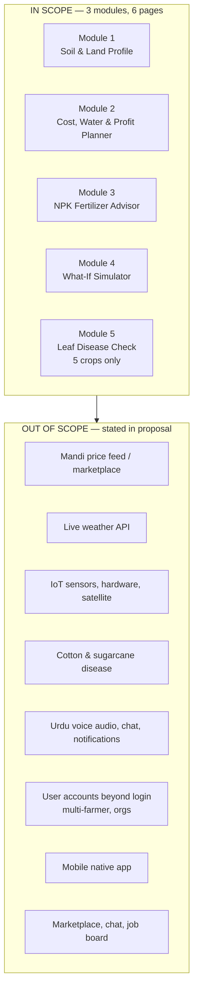

### Boundary table — the definitive list

| Layer | IN | OUT | Reason |
|---|---|---|---|
| **Crops** | wheat, rice, maize, potato, tomato | cotton, sugarcane, berseem, 7 more | Only these 5 have both agronomy data *and* disease-image data |
| **Districts** | 10 Punjab + 3 Sindh core, then all 30 | — | Seed full 30, demonstrate 5. No extra work |
| **Frontend** | React SPA, 6 pages, Recharts, Tailwind | Native app, map/GIS, chat | PWA covers mobile |
| **Backend** | Express, REST, JWT, 5 services | GraphQL, microservices, queues, websockets | Over-engineering for 6 pages |
| **Database** | MongoDB local, 8 user collections + 7 reference collections | Redis, Postgres, vector DB | No need for a second store |
| **ML** | 1 pre-trained ONNX, inference only | Any training, any fine-tuning, any GPU | No GPU on your laptop |
| **Network at runtime** | **None** | All live APIs | The core claim |
| **Auth** | Email + password + JWT | OAuth, OTP, roles, admin panel | Solo BSCS scope |
| **Language** | English UI, Urdu crop names | Full Urdu translation, audio | Urdu names = the low-literacy nod, cheap to add |

---

## 3. HHD — High-level Design

### 3.1 System context

```mermaid
flowchart LR
  F["Farmer<br/>or demonstrator"] -->|"browser only<br/>no app install"| UI["AgriPulse<br/>React SPA"]
  UI -->|"HTTP JSON<br/>localhost:5173 to :4000"| BE["Node.js + Express"]
  BE --> DB[("MongoDB<br/>local mongod")]
  BE --> AS["assets folder<br/>climate.json cost.json<br/>sfri.json model.onnx"]
  BE -.->|"blocked"| NET["Internet<br/>NOT REQUIRED"]
```

### 3.2 Layered architecture

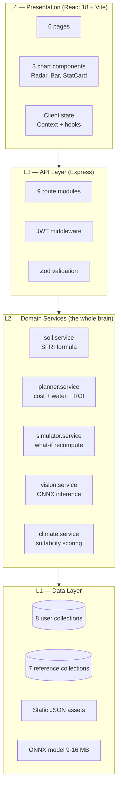

### 3.3 Component diagram

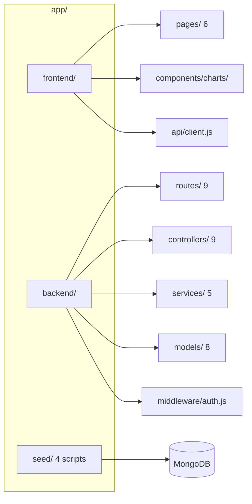

---

## 4. LLD — Low-level Design

### 4.1 Backend folder topology

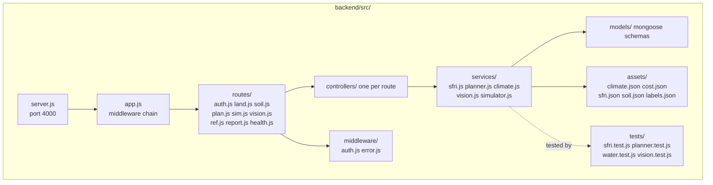

### 4.2 The domain services — one pure function each

This is the part that separates an FYP from a CRUD project. **Every service is a
pure function: same input, same output, no database, no clock.** That is what
makes them unit-testable, which is your evidence of correctness.

```mermaid
flowchart LR
  subgraph PURE["Pure — unit tested"]
    F1["sfri.nutrientNeeded<br/>(cropReq, soilTest, band)"]
    F2["sfri.bagsForNutrient<br/>(kgNutrient, grade, bagKg)"]
    F3["planner.totalCost<br/>(acres, costTable)"]
    F4["planner.waterLitres<br/>(acres, mmDepth)"]
    F5["planner.netProfit<br/>(yield, price, cost)"]
    F6["planner.roiPct<br/>(profit, cost)"]
    F7["climate.suitability<br/>(crop, climate)"]
    F8["simulator.recompute<br/>(acres, budget, crop)"]
  end
  subgraph IMPURE["Impure — thin wrappers"]
    G1["POST /api/plan/calculate"]
    G2["POST /api/soil/recommend"]
  end
  IMPURE --> PURE
```

### 4.3 The SFRI formula — the algorithm you will be examined on

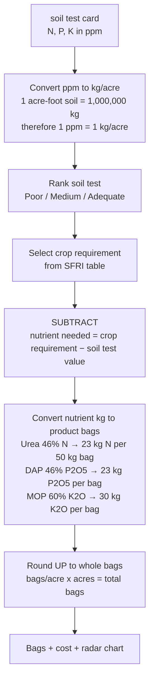

**Validation hook for your report:** SFRI publishes 2.35 bags Urea + 1.04 bags DAP
per acre for cotton in the PCPA Cotton Book. Implement the formula, run it, and
show it lands in that range. **A central algorithm validated against a
government publication is the strongest single artefact you can put in an FYP
report.**

### 4.4 Water — FAO-56 method

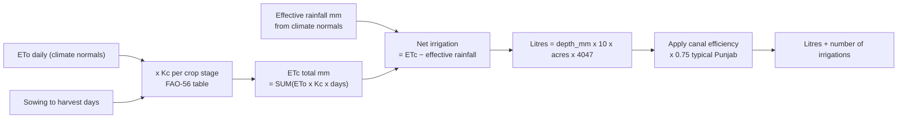

Every input is cited: ETo from the climate source, Kc from FAO-56 Table 12,
rainfall from the climate source. No magic numbers.

---

## 5. Data flows

### 5.1 The full flow — one glance

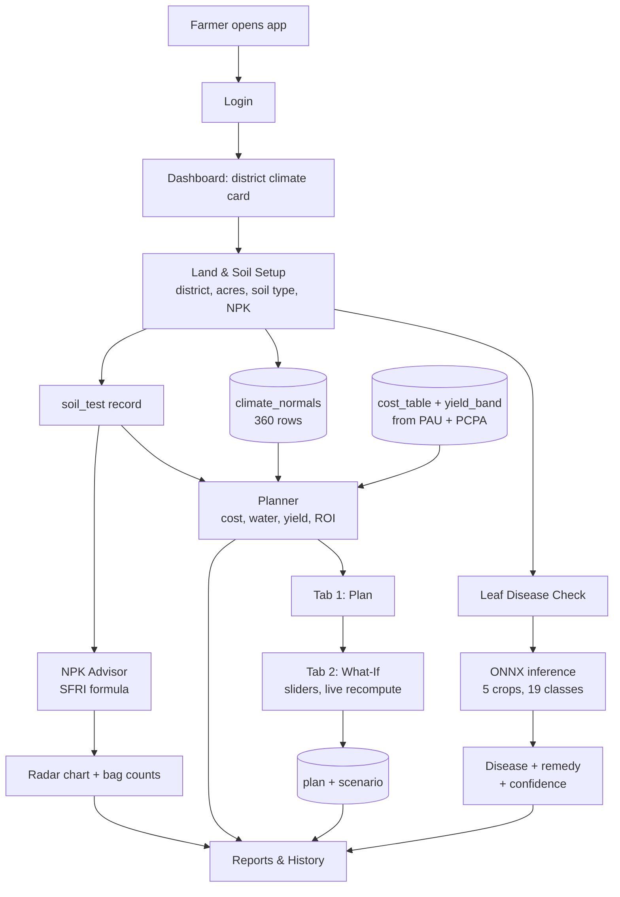

### 5.2 Planner sequence

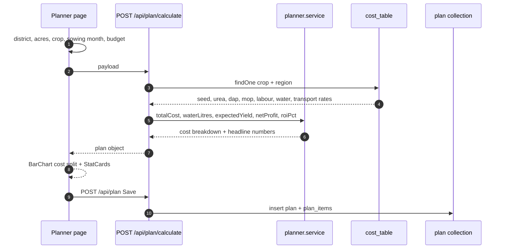

### 5.3 Simulator sequence — pure client recompute

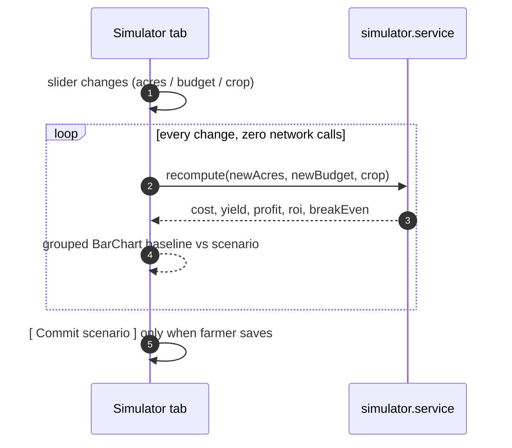

### 5.4 Vision sequence

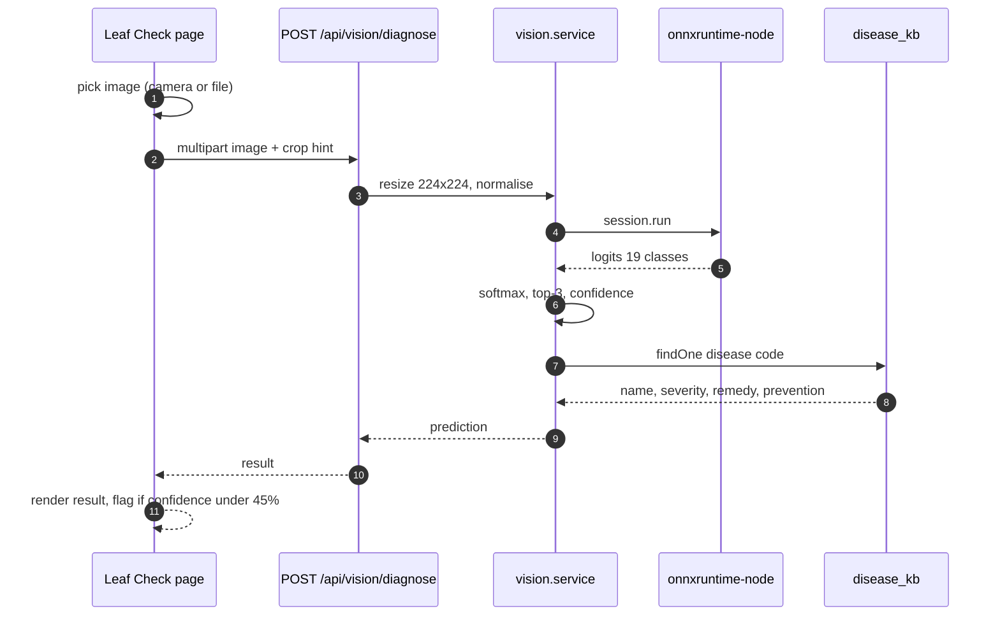

**Copy Leafwise's honesty pattern:** flag anything under 45% as *unknown* rather
than showing a confident wrong answer. PlantVillage images are clean studio
shots; a real field photo will be harder. Publishing that limitation is
credibility, not weakness.

---

## 6. API contract

```mermaid
flowchart LR
  AU["POST /api/auth/register<br/>POST /api/auth/login<br/>GET /api/health"]
  RF["GET /api/ref/districts<br/>GET /api/ref/crops<br/>GET /api/ref/soil-types"]
  CL2["GET /api/climate?district&month"]
  SL["POST /api/soil/test<br/>POST /api/soil/recommend"]
  PL2["POST /api/plan/calculate<br/>POST /api/plan<br/>GET /api/plan"]
  SM["POST /api/simulator/commit"]
  VS2["POST /api/vision/diagnose"]
  RP["GET /api/report/summary<br/>GET /api/report/plan/:id"]
  AU --> RF --> CL2 --> SL --> PL2 --> SM --> VS2 --> RP
```

Public (no JWT): `register`, `login`, `health`, all three `/api/ref/*`.
Everything else requires a valid JWT.

---

## 7. Data allocation — exact source for every row

| Collection | Rows | Source | Type | Licence / citation |
|---|---|---|---|---|
| `districts` | 30 | Punjab & Sindh Agriculture Departments | Geo reference | Public |
| `climate_normals` | **360** (30 × 12) | World Bank Climate Change Knowledge Portal, or NASA POWER, monthly means 1991–2020 | ETo, temp, rainfall | Free with attribution |
| `soil_types` | 5 | SFRI Punjab Guide-V | sandy, loam, clay, silt, calcareous | Government of the Punjab |
| `sfri_bands` | **20** (5 soils × N,P,K + pH classes) | **SFRI Punjab Guide-V** | ideal low/high, crop requirement per band | Government of the Punjab — **your credibility anchor** |
| `crops` | **5** | PAU Package of Practices | name_en, name_ur, season, duration days, Kc stages | Punjab Agricultural University |
| `yield_band` | **15** (5 crops × 3 regions) | PAU + provincial crop reports | maund/acre | Govt |
| `cost_table` | **30** (5 crops × 6 categories) | **PCPA Cotton Book** + PAU | land prep, seed, water, urea, DAP, labour, transport | Government of the Punjab |
| `fertilizer_prices` | 3 | NFDC Pakistan Fertilizer Statistics | urea, DAP, MOP retail PKR | Government of Pakistan |
| `crop_prices` | 5 | Punjab Agriculture Dept zaratnama | minimum support price PKR/maund | Govt |
| `disease_kb` | **19** | ipartzix/Crop_Disease_Image_Dataset class list + PAU pest guides | disease name, severity, remedy | Open + PAU |
| `labels.json` | 19 | same as above | model class order | Open |
| `model.onnx` | 1 file, 9–16 MB | Pre-trained on PlantVillage + wheat/rice sets | 19 classes, MobileNetV3-Small | Check the specific model's licence before publishing |
| **Total** | **≈ 490 reference rows + 1 model** | **5 government sources + 1 climate + 2 image** | | |

### The farmer-entered data — unchanged and small

| Field | Where | Type | Required |
|---|---|---|---|
| name, email, password | Auth | string | yes |
| district | Land & Soil | select, 30 | yes |
| land area | Land & Soil | acres, 0.1–100 | yes |
| soil type | Land & Soil | select, 5 | yes |
| crop | Planner | select, 5 | yes |
| sowing month | Planner | select, 12 | yes |
| budget | Planner | PKR | yes |
| N, P, K | NPK page | kg/ha ×3 | yes |
| pH | NPK page | slider 0–14 | yes |
| leaf image | Leaf Check | file or camera | for that page only |

**Eleven fields.** That is the entire user input surface. Everything else in the
system is arithmetic on seeded data.

---

## 8. Uniqueness — what nobody has built

### 8.1 The gap analysis

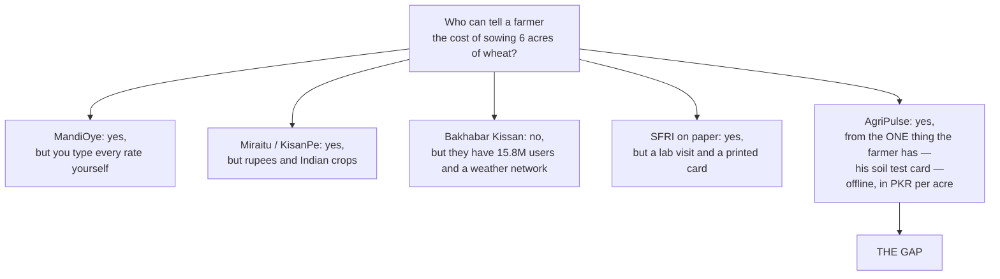

### 8.2 Feature-by-feature — nobody has the row marked

| Capability | Bakhabar Kissan | Agrixia | MandiOye | Kisan Sarathi | PlantVillage | **AgriPulse** |
|---|---|---|---|---|---|---|
| Works fully offline | ✗ | ✗ | ✗ | ✗ | ✓ | **✓** |
| No account needed | ✗ | ✗ | ✗ | ✗ | ✓ | **✗ (login, but local)** |
| Total cost in PKR per acre | ✗ | ✗ | partial | ✗ | ✗ | **✓** |
| Total water in litres | ✗ | ✗ | partial | ✗ | ✗ | **✓** |
| Expected yield + ROI before sowing | ✗ | ✗ | partial | ✗ | ✗ | **✓** |
| Fertilizer bags from **soil test** | ✗ | ✗ | ✗ (needs nutrient req. given) | ✗ | ✗ | **✓** |
| Radar chart of soil health | ✗ | ✗ | ✗ | ✗ | ✗ | **✓** |
| Implements **SFRI** standard | ✗ | ✗ | ✗ | ✗ | ✗ | **✓** |
| What-if slider simulation | ✗ | ✗ | ✗ | ✗ | ✗ | **✓** |
| Leaf disease ID | ✗ | ✗ | ✗ | ✗ | ✓ | **✓ (5 PK crops)** |
| Weather from climate normals | ✓ (needs net) | ✗ | ✗ | ✓ (needs net) | ✗ | **✓** |
| Requires hardware | 300 stations | ✗ | ✗ | ✗ | ✗ | **none** |

**Nobody, anywhere, combines cost + water + ROI + soil-test-derived fertilizer
bags + offline + local currency.** MandiOye has two of those columns. PlantVillage
has one. You are the only one with the full row.

### 8.3 The unique selling point — say it this way

> **AgriPulse is the only tool that starts from what a Pakistani farmer
> actually has — a soil test card and his land size — and computes, offline, in
> PKR and litres, exactly how much the crop will cost, how much water it will
> need, how many fertiliser bags to buy, and how much profit to expect. Every
> number traces to a Government of the Punjab or FAO publication.**
>
> Existing tools require the farmer to already know the answer, or require a
> network connection, or require a physical weather station.

That is the pitch. It is one sentence, it names the gap, it cites the sources,
and it is true.

---

## 9. The 6 pages

| # | Page | Module | Content |
|---|---|---|---|
| 1 | Login / Register | — | local JWT auth |
| 2 | Dashboard | 1 | district climate card, last plan, quick actions |
| 3 | Land & Soil Setup | 1 | district, acres, soil type, NPK, pH |
| 4 | Planner | 2 + 4 | Tab A plan · Tab B what-if sliders |
| 5 | NPK Advisor | 3 | radar chart + exact bags + cost |
| 6 | Leaf Check + Reports | 5 | two tabs: image diagnosis · plan history |

Pages 4 and 6 use tabs to keep the count at six while carrying seven features.

---

## 10. Revised timeline

| Week | Work | Gate |
|---|---|---|
| 1 | SFRI + PCPA + PAU + climate → 7 JSON files | 490 rows, 5 cited sources |
| 2 | Mongo seed script + Express + JWT auth | `GET /api/health` returns 200 |
| 3 | Module 1 + climate suitability | Page 2, 3 working |
| 4 | Module 2 cost/water/ROI + page 4 tab A | Planner numbers visible |
| 5 | Module 3 SFRI formula + radar + **PCPA cross-check** | **Bags match published cotton figures** |
| 6 | Module 4 simulator tab B + page 6 reports | All 6 pages |
| 7 | Module 5 — download ONNX, wire inference, label check | 5 crops classify |
| 8 | Unit tests, offline PWA, docs, defence rehearsal | Ready |

**Week 5 is the project.** Implement SFRI exactly, then prove it against the
PCPA's published per-acre bag counts.

---

## 11. Recommendations

1. **Name it `AgriPulse — Soil-Test Driven Farm Planner`.** Drop AI. The system
   contains no trained model, and the name should not claim otherwise.
2. **Scope the vision module to wheat, rice, maize, potato, tomato.** Real
   Pakistani crops, real free data. Say in the proposal which five and why.
3. **Lead with SFRI, not with React.** "We implement the Government of the
   Punjab's soil-test-based fertiliser standard, offline" beats "we use MongoDB
   and Recharts" every time.
4. **Validate against the PCPA cotton figures in week 5 and show the working.**
   That is the single strongest page you will write.
5. **Publish the offline limitation honestly** — flag under-45% predictions as
   unknown, as Leafwise does. Examiners reward this.
6. **Do not add** live weather, mandi prices, marketplace, chat, push
   notifications, full Urdu translation, or a native app. Each is a separate FYP.
7. **Keep the out-of-scope list from §2 in the proposal.** Stating what you
   deliberately did not build is the most senior-sounding thing an FYP report
   can do.

---

*Sources: SFRI Punjab Guide-V; PCPA Cotton Book (agripunjab.gov.pk); PAU Package
of Practices Rabi 2025-26; NFDC Pakistan Fertilizer Statistics; FAO fertilizer
use in Pakistan; World Bank Climate Knowledge Portal. Image datasets:
`iptarzix/Crop_Disease_Image_Dataset` (HuggingFace, 5 crops / 19 classes /
22,169 images), PlantVillage (Mohanty 2016, 54,306), PlantCity (Pakistan-
collected, 2025), Zenodo 7573133 wheat (CC-BY-4.0). Competitor pages read via
web search; no files were written to any sibling repository.*