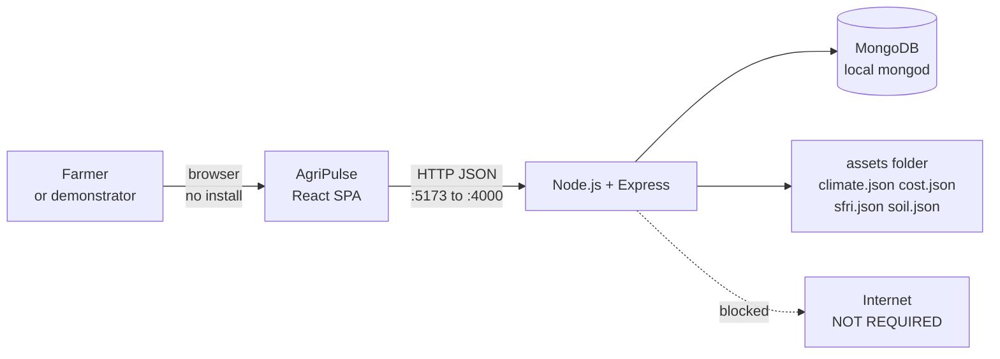
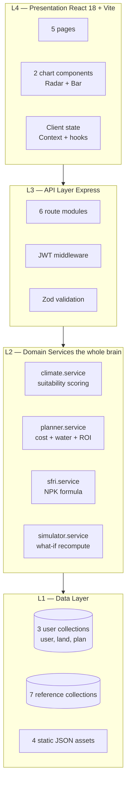
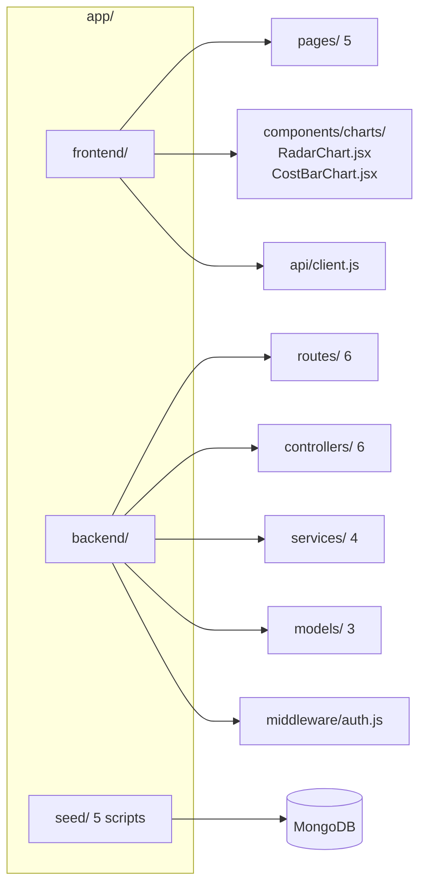
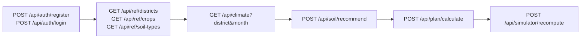
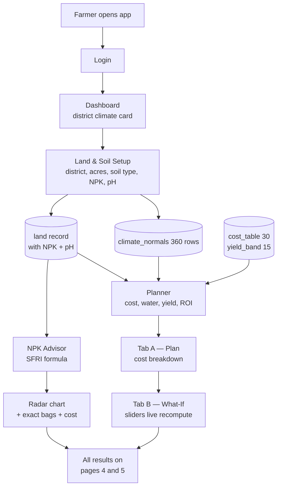
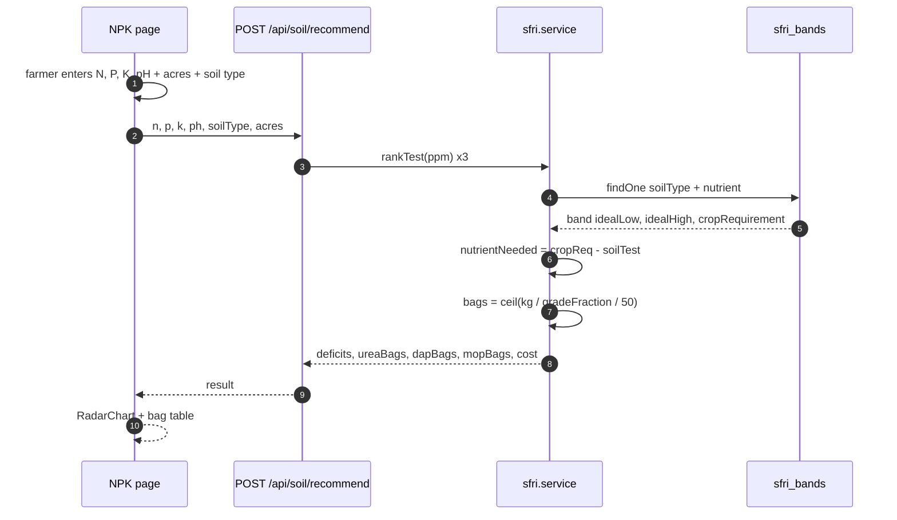
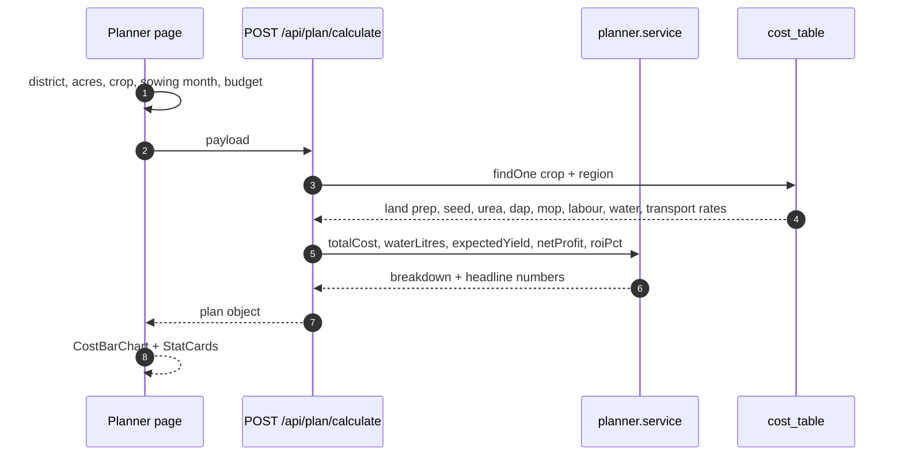
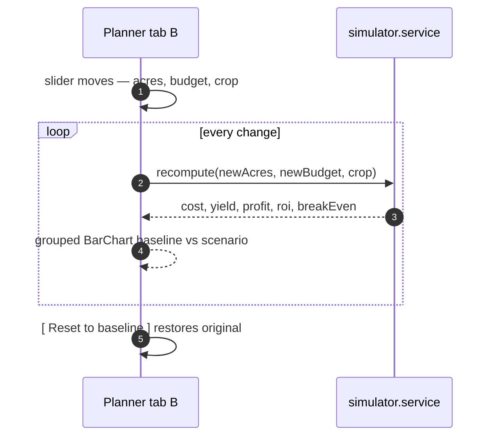
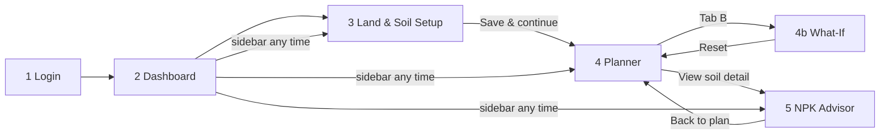

# A4 — Finalised Scope: 5 Pages, 4 Modules, HHD Locked, Wireframes

**LOCKED.** This document is the scope of record. Anything not listed here is
future work.

---

## 1. The final cut

You removed **Leaf Check + Reports**. That drops two things at once:

| Removed | Consequence |
|---|---|
| Leaf Check (vision) | No ML at all. No ONNX, no `onnxruntime-node`, no image labels. Zero model files in the repo |
| Reports & History | No plan archive, no scenarios table, no PDF export. Plans live in memory for the session only |

### Final scope

| # | Module | Answers problem |
|---|---|---|
| 1 | Land & Climate Profiler | P1 uninformed decisions, P4 hardware |
| 2 | Resource & Financial Planner | P2 no pre-harvest planning |
| 3 | NPK Soil Advisor | P1 uninformed decisions |
| 4 | What-If Simulator | P2 no pre-harvest planning |

### Final page list — 5 pages

| # | Page | Module | Status |
|---|---|---|---|
| 1 | Login / Register | auth | kept |
| 2 | Dashboard | 1 | kept |
| 3 | Land & Soil Setup | 1 | kept |
| 4 | Planner | 2 + 4 | kept, two tabs |
| 5 | NPK Advisor | 3 | kept |

### Problem coverage — final scorecard

| Problem | Factors | Fully covered | Partial | Not covered |
|---|---|---|---|---|
| P1 uninformed decisions | 4 | 3 | 1 | 0 |
| P2 financial planning | 5 | 4 | 1 | 0 |
| P3 disease diagnosis | 3 | 0 | 0 | **3 — future work** |
| P4 hardware dependency | 4 | 4 | 0 | 0 |
| **Total** | **16** | **11** | **2** | **3** |

**11 of 16 factors fully covered, 2 partial, 3 deferred.** Two problems solved,
one three-quarters, one as declared future work.

### What the system no longer needs

| Dropped | Was |
|---|---|
| `onnxruntime-node` dependency | removed |
| `model.onnx`, `labels.json`, disease KB (19 rows) | removed |
| `disease_kb` collection | removed |
| `scan` collection | removed |
| Reports/History queries and PDF export | removed |
| multipart upload middleware | removed |
| Scenario persistence | removed — simulator is session-only |

**The dependency list is now 9 packages, all boring:** `express`, `mongoose`,
`bcrypt`, `jsonwebtoken`, `cors`, `zod`, `dotenv`, `nodemon`, `morgan`.

### Consequence you should accept

Two of four problems remain partially addressed. That is fine for an FYP — but
it means **the proposal must state P3 as future work**, not as a solved problem.
A supervisor will read the problem statement. Do not contradict it.

---

## 2. HHD — locked

### 2.1 System context



### 2.2 Layered architecture



**Compare to A3:** two services gone, one collection gone, no ONNX layer.

### 2.3 Component diagram



---

## 3. Data model — locked

### 3.1 ER diagram

```mermaid
erDiagram
  USER ||--o{ LAND : owns
  USER ||--o{ PLAN : creates
  LAND ||--o{ PLAN : plans_for
  LAND ||--|| SOIL_TEST : has

  USER { ObjectId id PK, String name, String email UK, String passwordHash, Date createdAt }
  LAND { ObjectId id PK, ObjectId userId FK, String district, Float acres, String soilType, Float nKgh, Float pKgh, Float kKgh, Float ph, Date createdAt }
  PLAN { ObjectId id PK, ObjectId userId FK, ObjectId landId FK, String cropCode, Int sowingMonth, Float budgetPkr, Float totalCostPkr, Float waterLitres, Float expectedYieldMaund, Float netProfitPkr, Float roiPct }
```

**Three user collections.** `soil_test` is folded into `land` because there is
one soil test per plot in this scope. No separate collection needed.

### 3.2 Reference collections — 7

| Collection | Rows | Source |
|---|---|---|
| `districts` | 30 | Punjab & Sindh Agriculture Departments |
| `climate_normals` | 360 | World Bank Climate Portal / NASA POWER, 1991–2020 monthly means |
| `soil_types` | 5 | SFRI Punjab Guide-V |
| `sfri_bands` | 20 | **SFRI Punjab Guide-V** |
| `crops` | 5 | PAU Package of Practices |
| `yield_band` | 15 | PAU + provincial reports |
| `cost_table` | 30 | **PCPA Cotton Book** + PAU |

### 3.3 Total data budget

**420 reference rows + 3 user collections + 4 JSON asset files.**
No model file. No image dataset. No audio.

---

## 4. API contract — locked



Six route modules. Note the change from A3: `/api/vision/diagnose`,
`/api/plan` (save), `GET /api/plan`, `/api/report/*` and `/api/simulator/commit`
are all gone. `/api/simulator/recompute` is POST because it takes acres and
budget as input — but it writes nothing.

Public: `register`, `login`, all `/api/ref/*`. Everything else needs JWT.

---

## 5. Data flows — locked

### 5.1 Whole system



### 5.2 NPK sequence — the SFRI algorithm



### 5.3 Planner sequence



### 5.4 Simulator — pure recompute, session only



Nothing is written. No database call. No save button.

---

## 6. Wireframes — the 5 final screens

### Screen 1 — Login / Register

```
┌──────────────────────────────────────────────────────────────────────┐
│                                                    [theme] [EN|اردو] │
│                                                                      │
│                        ┌────────────────────┐                        │
│                        │    ⬤  AGRI PULSE   │                        │
│                        │  Soil-Test Driven  │                        │
│                        │   Farm Planner     │                        │
│                        └────────────────────┘                        │
│                                                                      │
│               Know your cost before you sow.                        │
│                                                                      │
│         ┌─────────────┐    ┌─────────────┐                           │
│         │   Sign in   │    │  Register   │   ← tabs                 │
│         └─────────────┘    └─────────────┘                           │
│                                                                      │
│         Email      ┌───────────────────────────┐                    │
│                    │ abdullah@student.edu      │                    │
│         Password   └───────────────────────────┘      [ 👁 show ]    │
│                                                                      │
│                    [       Sign in       ]                          │
│                                                                      │
│         ┌───────────────────────────────────────────────┐           │
│         │  Works fully offline                          │           │
│         │  No data leaves this machine.                  │           │
│         └───────────────────────────────────────────────┘           │
└──────────────────────────────────────────────────────────────────────┘
```

```
┌─── Register tab ─────────────────────────────────────────────────────┐
│                                                                      │
│         Full name     ┌───────────────────────────┐                 │
│                        │ Abdullah                  │                 │
│         Email          └───────────────────────────┘                 │
│         Password       └───────────────────────────┐    [ 👁 ]        │
│         Confirm        └───────────────────────────┘                 │
│                                                                      │
│                    [     Create account     ]                        │
│                                                                      │
│         Implements the Government of the Punjab                      │
│         soil-test-based fertiliser standard.                         │
└──────────────────────────────────────────────────────────────────────┘
```

**Behaviour:** register writes one `user` document. Login returns a JWT held in
`localStorage`. No email verification, no password reset — both out of scope.

---

### Screen 2 — Dashboard

```
┌──────────────────────────────────────────────────────────────────────┐
│ ⬤ AGRI PULSE   [Faisalabad ▾]                 [EN|اردو]  [👤] [◐]  │
├───────────────┬──────────────────────────────────────────────────────┤
│ ◉ Dashboard   │  Welcome back, Abdullah.        March 2026 · Rabi    │
│ ○ Land & Soil │  ┌───────────────────────────────────────────────┐   │
│ ○ Planner     │  │  YOUR FARM                                    │   │
│ ○ NPK Advisor │  │  6.2 acres   Faisalabad   Loam soil           │   │
│               │  │  [ Edit details → ]                           │   │
│               │  └───────────────────────────────────────────────┘   │
│               │  ┌──────────────┐┌──────────────┐┌──────────────┐   │
│               │  │ 6.2          ││ Loam         ││ Rabi         │   │
│               │  │ acres        ││ soil type    ││ season now   │   │
│               │  └──────────────┘└──────────────┘└──────────────┘   │
│               │  ┌───────────────────────────────────────────────┐   │
│               │  │  MARCH CLIMATE — FAISALABAD                   │   │
│               │  │  21°C avg    22 mm rain    34% rain prob.     │   │
│               │  │  Irrigation need: low    Frost risk: low     │   │
│               │  └───────────────────────────────────────────────┘   │
│               │  ┌───────────────────────────────────────────────┐   │
│               │  │  QUICK ACTIONS                               │   │
│               │  │  [1 Set up land]  [2 Plan a crop]             │   │
│               │  │  [3 Check soil]  [4 What if]                  │   │
│               │  └───────────────────────────────────────────────┘   │
│               │                                                          │
│               │  No plan this session —                          │   │
│               │  results are not saved and clear on reload.      │   │
└───────────────┴──────────────────────────────────────────────────────┘
```

**Behaviour:** climate card reads `climate_normals` by the saved district and
the current month. The "not saved" note is honest about the removed Reports
module — say it in the UI rather than hide it.

---

### Screen 3 — Land & Soil Setup

```
┌──────────────────────────────────────────────────────────────────────┐
│ ③ LAND & SOIL SETUP                                    [ Reset ]      │
├───────────────┬──────────────────────────────────────────────────────┤
│ sidebar       │ ┌──────────────────────────────────────────────────┐│
│               │ │ STEP 1 OF 2 — LAND                                ││
│               │ │                                                  ││
│               │ │ District   ┌──────────────────┐                   ││
│               │ │            │ Faisalabad    ▾  │                   ││
│               │ │            └──────────────────┘                   ││
│               │ │ Area       ┌────────┐  acres  (0.1 – 100)        ││
│               │ │            │  6.2   │                           ││
│               │ │            └────────┘                              ││
│               │ │ Soil type  ┌──────────────────┐                   ││
│               │ │            │ Loam          ▾  │                   ││
│               │ │            └──────────────────┘                   ││
│               │ │                                                  ││
│               │ │ ┌──────────────────────────────────────────────┐ ││
│               │ │ │ DISTRICT CLIMATE — March, Faisalabad         │ ││
│               │ │ │ 21°C   22 mm rain   34% rain prob.  48% RH  │ ││
│               │ │ │ Frost risk: none    Irrigation need: low    │ ││
│               │ │ └──────────────────────────────────────────────┘ ││
│               │ └──────────────────────────────────────────────────┘│
│               │                                                      │
│               │ ┌──────────────────────────────────────────────────┐│
│               │ │ STEP 2 OF 2 — SOIL TEST CARD                    ││
│               │ │ Enter the values printed on your soil test card.││
│               │ │ Soil type affects the target range.             ││
│               │ │                                                  ││
│               │ │ Nitrogen     ┌──────┐ kg/ha   low ▓▓░░░░░░░      ││
│               │ │              │  42  │                             ││
│               │ │              └──────┘                             ││
│               │ │ Phosphorus   ┌──────┐ kg/ha   low ▓▓▓░░░░░░      ││
│               │ │              │  18  │                             ││
│               │ │              └──────┘                             ││
│               │ │ Potassium    ┌──────┐ kg/ha   high ▓▓▓▓▓▓░░     ││
│               │ │              │  55  │                             ││
│               │ │              └──────┘                             ││
│               │ │ pH      ●━━━━━━━●━━━━━━━●━━━━━━  7.4   (6.0-8.5) ││
│               │ │                                                  ││
│               │ └──────────────────────────────────────────────────┘│
│               │                                                      │
│               │        [ Back ]        [ Save & continue → ]         │
└───────────────┴──────────────────────────────────────────────────────┘
```

**Behaviour:** N, P, K default to empty with a subtle low/high hint bar so the
farmer knows what range counts as deficient or excessive. Climate card
refreshes on district change only, not on every keystroke. `Save & continue`
navigates to the Planner.

---

### Screen 4 — Planner (Tab A: Plan)

```
┌──────────────────────────────────────────────────────────────────────┐
│ ④ PLANNER                                                  [Tab A|B] │
├───────────────┬──────────────────────────────────────────────────────┤
│ sidebar       │  Wheat ▾   Sowing: March ▾   Acres: 6.2   PKR 250,000│
│               │  ┌──────────────────────────────────────────────────┐│
│               │  │ ⓘ TAB A — PLAN                                   ││
│               │  └──────────────────────────────────────────────────┘│
│               │  ┌──────────────────────────────────────────────────┐│
│               │  │ TOTAL ESTIMATED COST                  PKR 184,300 ││
│               │  │ ─────────────────────────────────────────────────││
│               │  │ Land preparation     ███████░░░   32,700          ││
│               │  │ Seed                    ██░░░░░░░   18,600        ││
│               │  │ Urea (2.4 bags)         ████░░░░░░   38,900        ││
│               │  │ DAP  (1.1 bags)         ██░░░░░░░░   22,100        ││
│               │  │ Labour                  ██████░░░░   42,000        ││
│               │  │ Water (6 irrigations)   ███░░░░░░░   18,300        ││
│               │  │ Transport               █░░░░░░░░░    9,000        ││
│               │  │ ─────────────────────────────────────────────────││
│               │  │ Source: PCPA Cotton Book + PAU Package of        ││
│               │  │ Practices Rabi 2025-26                            ││
│               │  └──────────────────────────────────────────────────┘│
│               │  ┌───────────────┐┌───────────────┐┌──────────────┐  │
│               │  │ WATER         ││ YIELD         ││ NET PROFIT   │  │
│               │  │ 412,000 L     ││ 42.0 maund    ││ PKR 97,700   │  │
│               │  │ 6 irrigations ││ @ 3,450/maund ││ ROI 53%      │  │
│               │  │ FAO-56 method ││ PAU district  ││ break-even   │  │
│               │  │               ││ averages      ││ 2,614/maund  │  │
│               │  └───────────────┘└───────────────┘└──────────────┘  │
│               │  ┌──────────────────────────────────────────────────┐│
│               │  │  REVENUE vs COST                    CostBarChart││
│               │  │  ▐▐▐▐▐▐▐▐▐▐▐▐▐▐▐▐  revenue  PKR 282,000           ││
│               │  │  ▐▐▐▐▐▐▐▐▐▐▐    cost     PKR 184,300           ││
│               │  │  ▐▐▐          profit   PKR  97,700              ││
│               │  └──────────────────────────────────────────────────┘│
│               │  ┌──────────────────────────────────────────────────┐│
│               │  │  ⚠ Cost is within your budget of PKR 250,000.   ││
│               │  │    Headroom: PKR 65,700                        ││
│               │  └──────────────────────────────────────────────────┘│
│               │   ⓘ Results are not saved. They clear on reload.    │
└───────────────┴──────────────────────────────────────────────────────┘
```

**Behaviour:** every cost row shows its citation inline. The budget warning
turns red if cost exceeds budget. Citations on screen are unusual and they are
the reason a supervisor believes the numbers.

---

### Screen 4 — Planner (Tab B: What-If)

```
┌──────────────────────────────────────────────────────────────────────┐
│ ④ PLANNER                                                  [Tab A|B] │
├───────────────┬──────────────────────────────────────────────────────┤
│ sidebar       │  ┌──────────────────────────────────────────────────┐│
│               │  │ ⓘ TAB B — WHAT-IF SIMULATOR                      ││
│               │  │ Move a slider. Numbers change as you move.        ││
│               │  │ Nothing is sent anywhere; nothing is saved.       ││
│               │  └──────────────────────────────────────────────────┘│
│               │  ┌──────────────────────────────────────────────────┐│
│               │  │ Land area    ┌────────────────────────┐            ││
│               │  │             ●━━━━━━━━━━━━━━━━━━●     8.0 acres  ││
│               │  │ Budget      ┌──────────────────┐                  ││
│               │  │             ━━━━━━━━━━●━━━━━━━━   PKR 300,000   ││
│               │  │ Crop        ┌──────────────────┐                  ││
│               │  │             │ Rice         ▾  │                  ││
│               │  │             └──────────────────┘                  ││
│               │  │  Baseline: Wheat · 6.2 ac · PKR 250,000         ││
│               │  │  [ Reset to baseline ]                           ││
│               │  └──────────────────────────────────────────────────┘│
│               │  ┌──────────────────────────────────────────────────┐│
│               │  │  BASELINE vs SCENARIO           grouped BarChart││
│               │  │  ▐ Cost     184,300  │▐        241,900   ▲ +31%  ││
│               │  │  ▐ Revenue  282,000  │▐        368,100   ▲ +31%  ││
│               │  │  ▐ Profit    97,700  │▐        126,200   ▲ +29%  ││
│               │  └──────────────────────────────────────────────────┘│
│               │  ┌──────────────┐┌──────────────┐┌──────────────┐    │
│               │  │ COST         ││ PROFIT       ││ ROI          │    │
│               │  │ PKR 241,900  ││ PKR 126,200  ││ 52.2%        │    │
│               │  │ Δ +57,600    ││ Δ +28,500    ││ Δ −0.8 pts   │    │
│               │  └──────────────┘└──────────────┘└──────────────┘    │
│               │  ┌──────────────────────────────────────────────────┐│
│               │  │  More land, same budget → profit rises but ROI    ││
│               │  │  falls. Bigger is not always better.              ││
│               │  └──────────────────────────────────────────────────┘│
│               │  ⓘ Session only. There is no save button.            │
└───────────────┴──────────────────────────────────────────────────────┘
```

**Behaviour:** recompute runs in the browser on every slider event — zero
network calls. The insight box at the bottom is where you teach the concept
that matters: absolute profit and ROI move in opposite directions. That single
observation is the intellectual content of the module.

---

### Screen 5 — NPK Advisor

```
┌──────────────────────────────────────────────────────────────────────┐
│ ⑤ NPK SOIL ADVISOR                                    [Tab A|B]     │
├───────────────┬──────────────────────────────────────────────────────┤
│ sidebar       │  Loam soil · 6.2 acres · pH 7.4                     │
│               │  ┌────────────────────────────────┐┌───────────────┐  │
│               │  │                                ││ DEFICIENCY    │  │
│               │  │      RadarChart                ││ N  LOW        │  │
│               │  │         pH ╱╲                 ││    −18 kg/ha  │  │
│               │  │           ╱  ╲  K             ││ P  LOW        │  │
│               │  │        N ╱      ╲             ││    −12 kg/ha  │  │
│               │  │          │   P   │            ││ K  HIGH       │  │
│               │  │           ╲    ╱              ││    reduce dose│  │
│               │  │            ╲╱                 ││ pH  OK        │  │
│               │  │                                │└───────────────┘  │
│               │  │  ring = your soil              │┌───────────────┐  │
│               │  │  filled = target for loam      ││ SOURCE        │  │
│               │  └────────────────────────────────┘│ SFRI Punjab   │  │
│               │                                     │ Guide-V 2021   │  │
│               │  ┌──────────────────────────────────────────────────┐│
│               │  │ EXACT FERTILISER DOSAGE — 6.2 acres             ││
│               │  │ ─────────────────────────────────────────────────││
│               │  │ Urea 46% N     ████████   4 bags    PKR 38,900  ││
│               │  │ DAP  46% P₂O₅  ████       2 bags    PKR 22,100  ││
│               │  │ MOP  60% K₂O   ░░░         0 bags    PKR     0  ││
│               │  │ pH correction ░░░          none     pH 7.4 = OK ││
│               │  │ ─────────────────────────────────────────────────││
│               │  │ Fertiliser cost          PKR 61,000             ││
│               │  │ Fed into your plan on the Planner page.          ││
│               │  └──────────────────────────────────────────────────┘│
│               │  ┌──────────────────────────────────────────────────┐│
│               │  │  HOW THIS WAS CALCULATED                        ││
│               │  │  1  Soil test in kg/ha = ppm in your card        ││
│               │  │  2  Ranked Poor / Medium / Adequate (SFRI)       ││
│               │  │  3  Needed = crop requirement − your test value   ││
│               │  │  4  Converted to bags, rounded up               ││
│               │  │  Implemented from SFRI Punjab Guide-V.           ││
│               │  │  Cross-checked against PCPA Cotton Book figures. ││
│               │  └──────────────────────────────────────────────────┘│
│               │  ┌──────────────────────────────────────────────────┐│
│               │  │  ⚠ Potassium is above the target range for loam. ││
│               │  │    0 bags of MOP recommended.                    ││
│               │  └──────────────────────────────────────────────────┘│
└───────────────┴──────────────────────────────────────────────────────┘
```

**Behaviour:** the radar shows your value against the target ring for that soil
type — the gap *is* the deficiency. The "How this was calculated" panel is the
credibility artefact; keep it visible, not hidden behind a help icon. The MOP
line showing 0 bags matters more than the non-zero lines, because it shows the
system can tell a farmer to spend nothing.

---

## 7. Navigation map



Five pages, seven screens, six routes. Every page reachable in one click from
the sidebar except the two you must complete in order.

---

## 8. Responsive behaviour

| Breakpoint | Layout |
|---|---|
| Desktop ≥ 1024px | Persistent left sidebar, 5-page shell |
| Tablet 768–1023px | Collapsible sidebar, icons only |
| Mobile < 768px | Sidebar becomes a bottom tab bar. Radar shrinks to 240px, cost bar chart stacks horizontally. Sliders get 44px touch targets |

No separate mobile build. The PWA handles installability.

---

## 9. Design tokens

```css
:root {
  --bg-primary:   #FAF8F4;
  --bg-surface:   #FFFFFF;
  --text-primary: #1A1A17;
  --text-muted:   #6B6B60;
  --border:       #E4E0D8;
  --primary:      #2D6A4F;
  --deficient:    #B3261E;
  --adequate:     #2D6A4F;
  --excess:       #8A6D1F;
}
[data-theme="dark"] {
  --bg-primary:   #14140F;
  --bg-surface:   #1E1E17;
  --text-primary: #F2EFE6;
  --text-muted:   #9C9C90;
  --border:       #333329;
  --primary:      #52B788;
}
```

Muted agricultural palette — green as the single accent, red and amber reserved
exclusively for deficiency and excess so colour carries meaning rather than
decoration.

---

## 10. Final dependency list

| # | Package | Why |
|---|---|---|
| 1 | `express` | REST server |
| 2 | `mongoose` | MongoDB ODM |
| 3 | `bcrypt` | password hashing |
| 4 | `jsonwebtoken` | JWT sign/verify |
| 5 | `cors` | dev cross-origin |
| 6 | `zod` | request validation |
| 7 | `dotenv` | env config |
| 8 | `morgan` | request logging |
| 9 | `nodemon` | dev reload |

**Backend: 9 packages.** Frontend: `react`, `react-dom`, `react-router-dom`,
`recharts`, `vite`, `@vitejs/plugin-react`, `tailwindcss`. **No ML runtime. No
model file. No image handling library.**

---

## 11. 7-week build plan

| Week | Work | Gate — prove it works when |
|---|---|---|
| 1 | SFRI + PCPA + PAU + climate → 4 JSON files, seed script | 420 rows in MongoDB |
| 2 | Express, JWT auth, 6 routes, Zod | `POST /api/auth/login` returns a token |
| 3 | Screens 1–3, climate service | District + NPK save, climate card shows |
| 4 | Screen 4 tab A, planner service | Cost, water, yield, ROI appear with citations |
| 5 | Screen 5, SFRI service, radar | **Bags match PCPA published cotton figures** |
| 6 | Screen 4 tab B, simulator, responsive, theme | Sliders recompute live; mobile layout holds |
| 7 | Unit tests on 4 services, offline PWA, docs, defence prep | `npm test` green; app works with router off |

Week 5 is the project. Everything else is engineering.

---

## 12. Locked decisions — do not reopen

| # | Decision | Rationale |
|---|---|---|
| 1 | No vision / disease module | No training possible on your hardware; data exists but the scope cost exceeds the value. Future work |
| 2 | No Reports or saved plans | Removed. Session-only. Stated in the UI, not hidden |
| 3 | Name has no "AI" | System contains no trained model |
| 4 | 5 pages, 4 modules, 6 routes | Locked above |
| 5 | Crops: wheat, rice, maize, potato, tomato | Only 5. Kept from A3 but vision dropped, so crop count now serves the planner only |
| 6 | 3 user collections, 7 reference | 420 reference rows |
| 7 | SFRI Punjab Guide-V is the soil authority | Government publication, citable |
| 8 | PCPA Cotton Book is the cost authority | Government publication, citable |
| 9 | FAO-56 for water | International standard, citable |
| 10 | Citations shown on screen | Unusual, and the reason the numbers are believed |
| 11 | Offline, no runtime network | The one hard constraint that defines the project |
| 12 | P3 is future work in the proposal | 11 of 16 factors covered, 3 deferred. State it plainly |

---

*Specialist roles adopted this turn (read-only, sibling repo HTTP API):
`engineering-software-architect` (HHD decomposition, boundary discipline),
`design-ux-architect` (IA, design tokens, responsive strategy),
`design-ui-designer` (visual hierarchy, colour semantics),
`engineering-technical-writer` (locked-decision register). No sibling repository
was written to.*